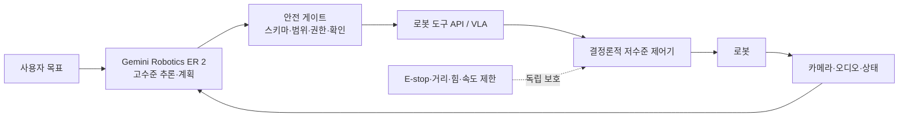

# Gemini Robotics 한국어 학습·실습 가이드

Google DeepMind의 [Gemini Robotics](https://deepmind.google/models/gemini-robotics/vla/)와 연결된 공식 자료를 바탕으로, 비전-언어-행동(VLA), embodied reasoning, 공간 추론, 도구 오케스트레이션, 실시간 스트리밍, 로봇 안전을 기초부터 전문 수준까지 학습하는 문서 트리입니다.

> 조사 기준일: **2026-08-02**
>
> 최신 공개 개발 경로: **Gemini Robotics ER 2 Preview**
>
> 직접 모터 행동을 생성하는 Gemini Robotics 1.5 VLA와 On-Device 2는 제한 공개입니다. 이 저장소는 누구나 재현할 수 있도록 ER 2 API와 안전한 모의 로봇을 기본 실습 환경으로 사용합니다.

## 먼저 구분해야 할 세 모델

| 모델 | 역할 | 출력 | 2026-08-02 접근성 |
| --- | --- | --- | --- |
| Gemini Robotics 1.5 | 이미지·명령을 모터 행동으로 바꾸는 VLA | 텍스트, 행동 | 파트너 대상 private preview |
| Gemini Robotics On-Device 2 | 네트워크 없이 로봇 장치에서 실행하는 경량 VLA | 행동 | trusted tester |
| Gemini Robotics ER 2 | 공간·시간 추론, 계획, 성공 판정, 도구 호출을 담당하는 상위 VLM | 텍스트·도구 호출 | Gemini API preview |

ER 2가 직접 안전한 관절 토크를 보장하는 것은 아닙니다. 일반적인 제품 구조는 다음과 같습니다.



## 학습 경로

### 1부 — 기초

- [00. 시작하기: 무엇을 어디까지 실습할 수 있는가](./docs/00-start-here.md)
- [01. 모델 계보와 시스템 아키텍처](./docs/01-model-family-and-architecture.md)
- [02. VLM, VLA, 행동 표현의 기초](./docs/02-vla-foundations.md)
- [03. Embodied reasoning과 로봇 좌표계](./docs/03-embodied-reasoning.md)

### 2부 — Gemini Robotics ER 2 기능

- [04. Pointing, bounding box, trajectory](./docs/04-spatial-reasoning.md)
- [05. Agentic vision과 코드 실행](./docs/05-agentic-vision.md)
- [06. Function calling과 장기 작업 오케스트레이션](./docs/06-task-orchestration.md)
- [07. Live API 스트리밍과 영상 진행도 추론](./docs/07-streaming-and-video.md)
- [08. On-Device와 embodiment adaptation](./docs/08-on-device-and-adaptation.md)

### 3부 — 전문 역량

- [09. 안전, 개인정보, 운영 경계](./docs/09-safety-and-privacy.md)
- [10. 평가, 벤치마크, 연구 읽기](./docs/10-evaluation-and-research.md)
- [11. 캡스톤: 안전한 테이블탑 작업 오케스트레이터](./docs/11-capstone.md)
- [12. 공식 자료 지도와 용어집](./docs/12-reference-map.md)

### 코드 실습

- [실습 실행 안내](./labs/README.md)
- [좌표·박스·평면 캘리브레이션 라이브러리](./labs/src/gemini_robotics_learning/geometry.py)
- [Gemini 응답 스키마 파서](./labs/src/gemini_robotics_learning/schemas.py)
- [독립 안전 게이트](./labs/src/gemini_robotics_learning/safety.py)
- [모의 로봇과 허용 목록 도구 실행기](./labs/src/gemini_robotics_learning/mock_robot.py)
- [오프라인 공간 grounding](./labs/examples/01_offline_spatial_grounding.py)
- [ER 2 API pointing](./labs/examples/02_api_pointing.py)
- [안전한 모의 pick-and-place](./labs/examples/03_safe_mock_orchestrator.py)
- [영상 완료 시점·진행도 API](./labs/examples/04_video_progress.py)
- [스트리밍 아키텍처 골격](./labs/examples/05_streaming_skeleton.py)
- [좌표 grounding 노트북](./labs/notebooks/01_coordinate_grounding.ipynb)

## 8주 커리큘럼

| 주차 | 주제 | 실습 산출물 | 전문가 관점의 질문 |
| --- | --- | --- | --- |
| 1 | VLM/VLA/ER 구분 | 모델 선택표 | 추론과 제어의 책임 경계는 어디인가? |
| 2 | 좌표계·공간 grounding | 좌표 변환 테스트 | 2D 점을 로봇 좌표로 바꾸려면 무엇이 필요한가? |
| 3 | ER 2 API | pointing·box 결과 | 생성형 출력을 어떻게 계약으로 바꾸는가? |
| 4 | 도구 호출 | mock pick-and-place | 모델이 요청한 행동을 왜 바로 실행하면 안 되는가? |
| 5 | agent loop | 단계 제한·재시도·확인 | 장기 작업의 종료·복구 조건은 무엇인가? |
| 6 | 영상·streaming | progress evaluator | perception rate와 control rate를 왜 분리하는가? |
| 7 | 안전·평가 | fault matrix | false negative를 어떻게 우선 관리하는가? |
| 8 | 캡스톤 | 데모·보고서·ADR | 모델 버전 변경에도 시스템을 유지할 수 있는가? |

## 빠른 시작

API 키 없이 먼저 오프라인 실습을 실행합니다.

```powershell
cd Gemini-robotics/labs
python -m unittest discover -s tests -v
$env:PYTHONPATH = "src"
python examples/01_offline_spatial_grounding.py
python examples/03_safe_mock_orchestrator.py
```

API 실습은 제한된 키와 본인이 촬영하거나 사용 권한이 있는 이미지로 수행합니다.

```powershell
python -m venv .venv
.\.venv\Scripts\Activate.ps1
python -m pip install -r requirements.txt
$env:GEMINI_API_KEY = "AI Studio에서 발급한 제한된 키"
$env:PYTHONPATH = "src"
python examples/02_api_pointing.py --image .\path\to\scene.jpg --query "파란 블록"
```

API 키를 코드, 노트북, `.env`, 셸 기록에 커밋하지 마세요. 2026년 9월에는 표준 키가 거부될 예정이므로 새 프로젝트는 authorization key를 우선 사용합니다.

## 학습 완료 기준

- VLA와 ER 모델의 출력·지연·책임 차이를 설명한다.
- `[y, x]`, 0~1000 좌표를 픽셀과 로봇 작업 좌표로 변환한다.
- 모델 출력을 JSON 스키마로 검증하고 실패 시 움직이지 않는다.
- tool allowlist, 작업 공간, 속도, step, timeout, human confirmation을 적용한다.
- API·네트워크·모델이 멈춰도 저수준 안전 계층이 독립적으로 정지한다.
- pointing, task success, latency, unsafe-action false negative를 별도 평가한다.
- 실제 로봇 연결 전 mock → simulation → hardware-in-the-loop 단계를 통과한다.

## 중요한 안전 경고

이 자료는 교육용이며 안전 인증 시스템이 아닙니다. Gemini Robotics 모델 카드에는 의료, 운송 등 오작동이 사망·상해·재산 피해로 이어질 수 있는 safety-critical 용도에 사용하지 말라는 제한이 명시되어 있습니다. 실제 로봇에는 모델과 독립된 E-stop, 하드웨어 한계, 속도·힘 제한, 보호 정지, 작업 공간 분리, 감독자를 두어야 합니다.
