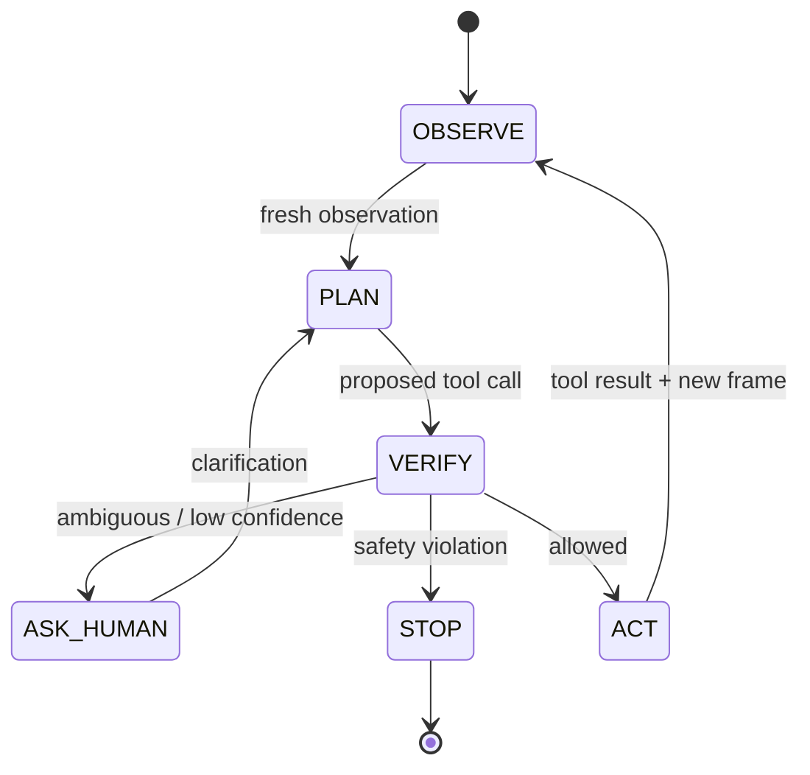

# 01. 모델 계보와 시스템 아키텍처

## 1. Gemini Robotics 계보

### 2025년: Gemini Robotics와 Robotics-ER

초기 기술 보고서는 Gemini 2.0을 기반으로 두 계열을 제시했습니다.

- **Gemini Robotics:** 시각·언어 입력을 연속 로봇 행동으로 바꾸는 generalist VLA
- **Gemini Robotics-ER:** object detection, pointing, trajectory, grasp, multi-view correspondence, 3D box와 같은 embodied reasoning을 강화한 VLM

VLA는 `관찰 + 명령 → 행동`을 직접 학습하고, ER은 상황을 이해하고 계획하거나 다른 프로그램을 호출하는 상위 두뇌에 가깝습니다.

### 2025년 하반기: Robotics 1.5

Robotics 1.5는 다음을 강조했습니다.

- 여러 robot embodiment에서 학습하는 motion transfer
- 행동 사이에 추론을 배치하는 thinking
- ER 1.5가 고수준 계획을 만들고 VLA 1.5가 실행하는 agentic 구성

### 2026년: ER 2와 On-Device 2

ER 2는 Gemini 3.5 Flash 기반의 공개 API 모델입니다. 공간뿐 아니라 시간적 이해, progress classification, moment finding, multi-robot orchestration, streaming tool use를 강화했습니다.

On-Device 2는 네트워크 제약이 있는 로봇에서 로컬 행동 생성을 목표로 하지만 trusted tester 대상입니다. 공식 설명은 200개 미만 예제로 새 로봇에 적응 가능하다고 소개하지만, 데이터 품질과 embodiment 차이에 따라 실제 결과는 달라질 수 있습니다.

## 2. System 2 / System 1 구조

로봇 분야에서는 느리지만 유연한 고수준 추론과 빠른 저수준 행동을 분리하는 것이 유용합니다.

| 계층 | 역할 | 예시 주기 | 실패 처리 |
| --- | --- | ---: | --- |
| ER planner | 목표 분해, 도구 선택, 성공 판정 | 0.1~1 Hz 수준 | 질문, 재계획, 중단 |
| VLA/skill | grasp, place, navigate 같은 기술 실행 | 수 Hz 이상 | timeout, skill failure |
| controller | joint/velocity/force servo | 수십~수천 Hz | 즉시 보호 정지 |
| safety PLC/controller | E-stop, limit, human proximity | 독립 실시간 | 전원·토크 차단 |

주기는 예시입니다. 핵심은 cloud VLM의 지연이 저수준 제어 loop를 대신할 수 없다는 점입니다.

## 3. 관찰-계획-행동-검증 loop

단방향 `prompt → motor`가 아니라 행동 결과를 다시 관찰해야 합니다. 성공했다고 모델이 말한 것과 실제 성공은 다릅니다.

## 4. 데이터 계약

각 계층 사이에 다음을 버전 관리합니다.

- 관찰 timestamp와 frame ID
- 카메라 intrinsics/extrinsics
- 좌표 frame 이름
- 모델 ID와 prompt version
- tool JSON schema
- 물리 단위와 허용 범위
- timeout, retry, confirmation 정책
- 모델 결과와 실제 도구 결과

## 5. 실무 설계 원칙

1. 모델은 목표를 제안하고 안전 계층이 허용 여부를 결정합니다.
2. 각 tool은 작고 검증 가능한 primitive로 만듭니다.
3. `move_anywhere(command: str)` 같은 광범위한 tool을 피합니다.
4. tool 결과는 실제 센서 검증값을 반환합니다.
5. model session이 끊기면 로봇은 안전 상태로 갑니다.
6. preview 모델 ID는 설정으로 분리합니다.

## 연습 문제

다음 기능이 어느 계층에 속하는지 분류하세요.

- “컵을 찾아라” → ER perception
- “컵을 잡는 joint trajectory” → VLA/skill planner
- “관절 속도가 한계를 넘지 않게 한다” → controller
- “사람이 1m 안에 들어오면 멈춘다” → 인증된 독립 안전 계층
- “컵을 놓았는지 영상으로 확인한다” → ER success detector + 센서 검증

