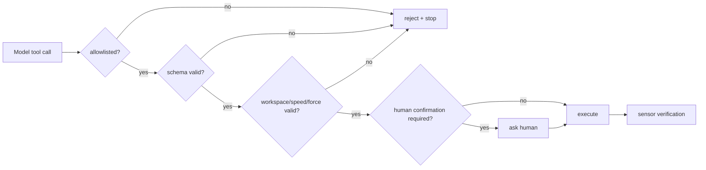

# 06. Function calling과 장기 작업 오케스트레이션

## 공식 예제의 핵심

공식 ER 2 task orchestration 예제는 `move(x,y,high)`와 `setGripperState(opened)`라는 mock API를 모델에 tool로 노출합니다. 모델이 function call을 반환하면 애플리케이션이 실행하고, 결과를 `previous_interaction_id`와 함께 다시 보내 다음 단계를 얻습니다. 최대 15단계 제한을 둡니다.

## 1. Agent loop

```text
initial observation + goal + tools
→ model interaction
→ proposed tool calls
→ policy/safety validation
→ execute tool
→ observe real result
→ function_result
→ continue with previous_interaction_id
→ stop / success / ask human / timeout
```

## 2. Tool 설계

나쁜 도구:

```text
execute_python(code)
move_robot(free_form_text)
set_joint_torque(any_array)
```

좋은 도구:

```text
move_to_named_pose(name: enum)
move_cartesian(frame: enum, x: bounded, y: bounded, z: bounded, speed: bounded)
set_gripper(opened: bool, max_force_n: bounded)
stop(reason: string)
ask_human(question: string)
```

parameter schema가 좁을수록 검증과 테스트가 쉽습니다.

## 3. 모델 호출과 실제 실행 사이의 게이트



## 4. Step limit만으로 충분하지 않다

필수 종료 조건:

- maximum tool calls
- wall-clock deadline
- per-tool timeout
- repeated-call detector
- no-progress detector
- total travel/energy budget
- model/API cost budget
- external stop flag

## 5. 실제 tool result

공식 mock 예제는 항상 success를 반환하지만 실제 시스템은 구체적인 증거가 필요합니다.

```json
{
  "status": "failed",
  "reason": "grasp_not_detected",
  "observed_at": "...",
  "joint_state_age_ms": 18,
  "object_still_visible": true,
  "retryable": true
}
```

모델에게 성공을 거짓으로 보고하면 잘못된 다음 행동을 만듭니다.

## 6. Idempotency와 재시도

네트워크 timeout 뒤에 같은 명령을 재전송하면 두 번 실행될 수 있습니다.

- 각 tool call에 idempotency key
- 이미 처리한 call ID 저장
- retry-safe query와 위험한 action 구분
- action status 조회 API
- 모호한 timeout은 자동 재시도 대신 정지·확인

## 7. 승인 수준

| 위험 | 예 | 정책 |
| --- | --- | --- |
| 낮음 | 이미지 분석, 상태 조회 | 자동 |
| 중간 | 빈 공간의 mock 이동 | 정책 통과 후 자동 |
| 높음 | 실제 arm 이동, grasp | 명시적 승인·저속 |
| 금지 | 사람 접촉, safety-critical 작업 | 실행하지 않음 |

## 실습

`03_safe_mock_orchestrator.py`는 다음을 보여줍니다.

- allowlist
- typed argument 검증
- workspace와 forbidden zone
- 최대 이동 거리
- step limit
- 실패 시 stop
- 실행 log

정상 plan을 실행한 뒤 `--unsafe-demo`로 금지 영역 이동이 거부되는지 확인합니다.

## 완료 조건

- model tool call을 제안으로 취급한다.
- 실제 센서 결과를 model에 되돌린다.
- timeout 뒤 중복 실행을 막는다.
- no-progress와 반복 호출을 종료한다.

