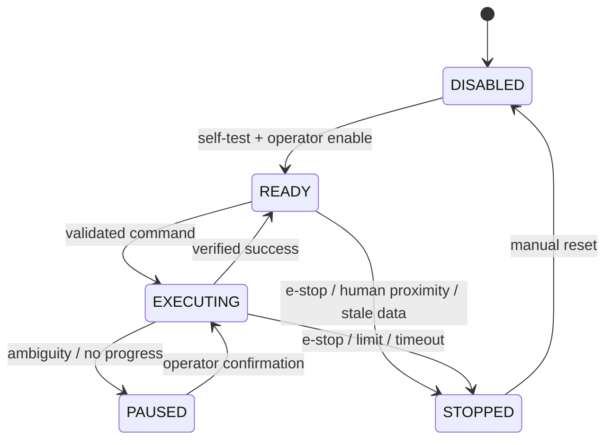

# 09. 안전, 개인정보, 운영 경계

## 1. 안전은 모델 기능이 아니라 시스템 속성

Google DeepMind는 semantic, physical, operational safety를 겹치는 방어층으로 설명합니다. 하나의 완벽한 보호막이 아니라 여러 층이 사고 경로를 막는 “Swiss cheese” 접근입니다.

### Semantic safety

- instruction이 위험한지 판단
- payload, gripper, 오염 같은 제약 준수
- 모호하면 질문
- VLA가 수행 불가능한 작업이면 사람 개입 요청

### Physical safety

- E-stop
- joint, speed, force, power limit
- collision avoidance
- speed and separation monitoring
- 안전 PLC/controller

### Operational safety

- 작업 구역·교육·점검
- 승인과 감독자
- 로그·incident response
- 모델·prompt·tool version 관리

## 2. ER 2 안전 보고서의 핵심

2026년 안전 보고서는 agent가 다음 경로 중 하나를 선택하는 문제를 평가합니다.

- VLA/skill에 안전한 작업 위임
- 제약 위반 작업 거부
- 모호한 instruction에 human clarification 요청
- 사람 근접·hardware fault에 safety tool 호출
- VLA confidence가 낮으면 human intervention

중요하게도 보고서 자체는 인증 하드웨어, redundancy, real-time guarantee 같은 **functional safety architecture를 평가하지 않았다**고 명시합니다.

## 3. False negative를 우선하는 이유

사람이 가까운데 멈추지 않는 false negative는 불필요하게 멈추는 false positive보다 훨씬 위험합니다. 보고서는 현재 frontier model이 FNR과 FPR을 동시에 0에 가깝게 만들지 못한다고 설명하며 deterministic low-level guardrail과 함께 사용해야 한다고 결론 냅니다.

## 4. 안전 상태기계

모델은 `STOPPED → EXECUTING` 전환 권한을 가지지 않습니다. 수동 reset과 재검사가 필요합니다.

## 5. Defense in depth 체크리스트

- [ ] cloud/model failure와 무관한 E-stop
- [ ] 하드웨어 joint·speed·force limit
- [ ] tool allowlist와 JSON schema
- [ ] workspace·forbidden zone
- [ ] observation/command freshness
- [ ] maximum step·distance·time budget
- [ ] low confidence/ambiguous → ask human
- [ ] 실제 sensor 기반 success verification
- [ ] audit log와 replay
- [ ] software mock fault injection
- [ ] 실제 하드웨어 위험 분석과 전문가 검토

## 6. 개인정보

Gemini API Robotics 문서는 식별 가능한 사람의 영상·음성이 수집될 수 있음을 경고합니다. 사람이 주변에 있다면 사전 고지와 동의가 필요하고, 가능한 범위에서 face blur와 비식별 공간을 사용하라고 안내합니다.

실무 원칙:

- 공개 데모는 동의받은 참가자만 촬영
- 필요 없는 audio는 수집하지 않음
- 저장 전 얼굴·명찰·화면 정보 blur
- raw video 보존 기간 최소화
- access log와 삭제 절차
- dataset/model provider의 약관 검토
- API 전송 지역과 조직 정책 확인

## 7. API 키와 공급망

- 키를 코드·노트북에 직접 쓰지 않음
- `.env`를 Git에서 제외
- authorization key 우선
- production은 backend/Secret Manager 사용
- 비용·quota alert
- SDK와 model ID lock
- dependency checksum과 vulnerability scan

2026년 9월부터 Gemini API는 standard key를 거부할 예정이므로 migration 계획을 둡니다.

## 8. 금지 범위

이 교육 프로젝트에서는 다음을 실행하지 않습니다.

- 사람 신체 접촉
- 의료·운송·중장비
- 날카롭거나 뜨겁거나 무거운 물체
- 안전 장치 없는 실제 arm 자동 동작
- model-generated local code 실행
- 감독자 없는 원격 동작

## 완료 조건

- model safety와 functional safety를 구분한다.
- false negative 중심의 평가를 설계한다.
- STOPPED에서 자동 복구하지 않는다.
- 개인정보 고지·동의·최소 수집을 문서화한다.

