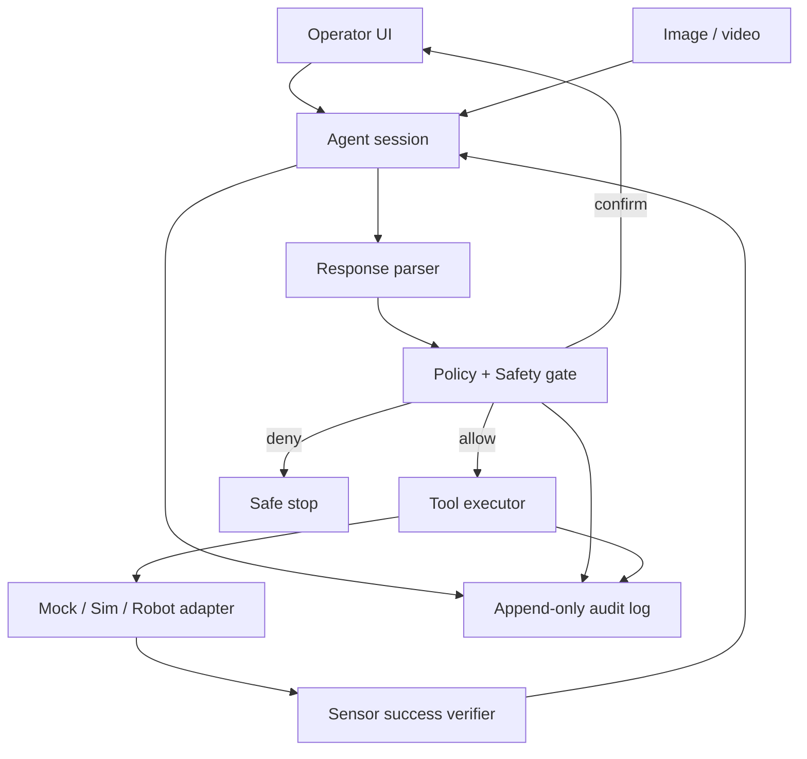

# 11. 캡스톤: 안전한 테이블탑 작업 오케스트레이터

## 프로젝트 목표

카메라 이미지와 “파란 블록을 주황색 그릇에 넣어라”라는 명령을 ER 2가 해석하고, 모의 로봇 tool을 단계적으로 호출하며, 모든 제안이 안전 gate를 통과하고 결과가 검증되는 시스템을 만듭니다.

실제 arm 연결은 캡스톤의 필수 조건이 아닙니다. mock과 simulation에서 실패·복구를 증명하는 것이 우선입니다.

## 아키텍처

## Milestone 1 — 오프라인 계약

- point/box schema
- tool schema
- frame·단위·timestamp
- workspace와 forbidden zone
- 상태기계
- 정상/실패 result

합격: malformed·out-of-range·unknown tool이 모두 거부됩니다.

## Milestone 2 — Mock robot

- `move`와 `set_gripper`
- hover-before-descend rule
- maximum travel per step
- gripper state
- step·deadline budget
- execution log

합격: 정상 plan은 완료되고 금지 영역 plan은 STOPPED가 됩니다.

## Milestone 3 — ER 2 pointing

- 이미지 업로드
- 대상 point 요청
- JSON parse
- pixel과 table 좌표 변환
- 반복 질의 dispersion

합격: API 결과는 표시만 하고 자동 실행하지 않으며, validation report가 남습니다.

## Milestone 4 — Function calling loop

- tool allowlist를 모델에 제공
- proposed call과 실제 실행 분리
- operator confirmation
- real function result 반환
- max step·no-progress·timeout

합격: 같은 call ID가 재전송돼도 두 번 움직이지 않습니다.

## Milestone 5 — 영상 성공 판정

- action 전후 영상 기록
- moment finding 또는 progress bracket
- local sensor와 결과 비교
- false-success 시 retry가 아닌 pause

합격: VLM과 local sensor가 충돌하면 안전한 쪽을 선택합니다.

## Milestone 6 — Fault injection

| 장애 | 기대 동작 |
| --- | --- |
| API timeout | 현재 행동 완료 후 정지, 자동 재실행 없음 |
| malformed JSON | 실행 없음, 오류 기록 |
| unknown tool | 거부·session 중단 |
| workspace 밖 | safety violation |
| 사람 등장 | 독립 sensor가 즉시 stop |
| stale image | 재관찰 요청 |
| grasp 실패 | pause/재계획, 성공으로 보고하지 않음 |
| 반복 plan | no-progress detector가 중단 |

## 포트폴리오 산출물

- architecture와 state machine
- model/prompt/tool contract
- threat model
- safety case 초안
- 30개 이상의 evaluation scene
- slice별 metrics
- latency·cost report
- fault injection 영상
- ADR: “ER 2를 저수준 controller로 사용하지 않은 이유”
- 알려진 한계

## 이력서 문장 예시

> Gemini Robotics ER 2의 spatial grounding과 function calling을 이용한 안전한 tabletop orchestration prototype을 설계하고, typed tool contract·workspace gate·human confirmation·idempotency·fault injection을 적용해 생성형 모델 제안과 물리 실행을 분리했으며 pointing 오차, p95 latency, unsafe-action false negative를 자체 benchmark로 측정했습니다.

숫자는 실제 측정 후 채웁니다.

## 전문 확장

- ROS 2 action adapter
- MoveIt 2 planning scene
- depth camera와 hand-eye calibration
- local detector와 ER consensus
- streaming heartbeat
- multi-robot task allocation
- ASIMOV-Agentic 스타일 safety evaluation
- signed prompt/tool configuration과 rollback

