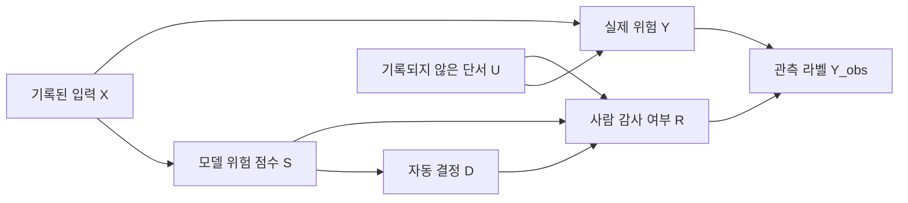

# [2026-10-01] 오늘 학습: 선택 편향·DAG·MAR/MNAR & 역확률 감사·능동 표집 피드백

> **오늘의 핵심 문장:** 위험해 보이는 사례만 사람이 확인하면 오류는 많이 발견할 수 있지만, 그 표본의 오류율은 전체 서비스의 오류율이 아니다. 누가 어떤 확률로 감사 대상이 되었는지 기록하고 그 선택 확률의 역수로 되돌려야 전체 위험을 추정할 수 있다.

지난 시간에는 같은 계열 LLM judge가 함께 틀리는 현상을 계층적 랜덤효과로 표현하고, posterior predictive check로 모형을 비판했으며, 배포 입력 분포가 바뀔 때 weighted conformal로 재검량하는 방법을 배웠다. 그런데 아직 더 근본적인 질문이 남았다.

**사람이 붙인 확정 라벨 자체가 무작위로 모인 것이 아니라면 어떻게 해야 할까?**

운영팀은 보통 모델 점수가 높거나, 사용자가 신고했거나, 새 기능을 쓴 요청을 우선 검토한다. 이 방식은 사고를 빨리 찾는 데 유용하지만 “검토된 표본”과 “전체 트래픽”을 서로 다른 모집단으로 만든다. 오늘은 이 간극을 다룬다.

- **수학:** 인과 방향을 DAG로 적고, MCAR·MAR·MNAR을 구분한다.
- **추정:** 감사 포함확률을 이용해 Horvitz–Thompson형 역확률 가중 추정량을 유도한다.
- **안정화:** Hájek 정규화, 유효표본크기, 이중강건 추정, 교차적합을 비교한다.
- **운영:** 능동 표집이 만드는 피드백 루프를 끊기 위해 발견 스트림과 확률적 감사 스트림을 분리한다.
- **트렌드:** GPT-6.1 Sol의 비용 효율적 에이전트 실행과 LFM2.5-VL-DSpark의 오픈웨이트 VLM 추론 가속을 살펴본다.

> **난이도 표지:** 오늘 수식은 중요도 가중을 다시 사용하지만, 9월 18일의 정책 평가나 9월 30일의 covariate shift와 목적이 다르다. 오늘의 분모는 “그 행동을 선택한 정책 확률”이나 “두 입력 분포의 밀도비”가 아니라 **정답 라벨이 관측될 감사 포함확률**이다.

## 1. 지식의 씨앗: 이 개념들은 왜 탄생했을까?

### 1.1 왜 “확인된 오류율”이 전체 오류율이 아닐까?

병원에서 증상이 심한 사람에게만 정밀검사를 하면, 정밀검사 대상자의 질병률은 전체 방문자의 질병률보다 높다. 이것은 검사가 틀렸기 때문이 아니라 **검사 대상이 되는 과정**이 이미 위험과 관련되어 있기 때문이다.

AI 서비스의 사람 검토도 같다.

- 안전 detector 점수가 높은 응답을 더 자주 본다.
- 사용자가 신고한 대화만 자세히 본다.
- 새 모델, 새 언어, 새 도구 호출을 집중 감사한다.
- 장애가 난 세션은 보존하지만 정상 세션은 빨리 삭제한다.
- reviewer가 “이상해 보인다”고 느낀 사례를 임의로 추가한다.

이렇게 모인 라벨에서 단순히

$$
\frac{\text{감사 표본의 위험 사례 수}}
{\text{감사 표본 수}}
$$

를 계산하면 “감사자가 보게 된 사례의 위험률”을 얻는다. 우리가 알고 싶은 “전체 트래픽의 위험률”과는 일반적으로 다르다. 이 차이를 **선택 편향**, 또는 정답 검증 여부가 선택적이라는 뜻에서 **verification bias**라고 부른다.

### 1.2 왜 화살표 그림인 DAG가 필요할까?

상관계수만 보면 위험 점수와 실제 위험, 감사 여부가 서로 관련 있다는 사실은 알 수 있다. 그러나 무엇을 조건으로 보정해야 하는지는 알기 어렵다.

**DAG**는 Directed Acyclic Graph의 약자다.

- **Directed:** 화살표에 방향이 있다.
- **Acyclic:** 화살표를 따라가 원래 노드로 돌아오는 순환이 없다.
- **Graph:** 변수는 점, 직접적인 인과 관계는 화살표로 그린다.

DAG는 데이터가 자동으로 밝혀 주는 정답 그림이 아니다. 우리가 가정한 데이터 생성 과정을 명시해, 어떤 변수를 기록해야 하고 어떤 보정이 가능한지 토론하게 하는 설계도다.

오늘 사용할 기본 그림은 다음과 같다.



$R=1$일 때만 실제 라벨 $Y$를 확인할 수 있다. 기록되지 않은 단서 $U$가 실제 위험과 감사 선택에 모두 영향을 주면, 기록된 변수만으로는 선택 과정을 완전히 설명할 수 없다. 이것이 MNAR 문제의 핵심이다.

### 1.3 왜 “무작위 감사”를 일부러 섞어야 할까?

위험 점수가 높은 사례만 보면 제한된 예산으로 많은 오류를 찾는다. 그러나 위험 점수가 낮은 영역을 전혀 보지 않으면 detector가 모르는 새로운 실패 유형은 영원히 라벨을 얻지 못한다.

지도에서 밝은 곳만 계속 탐색하면 보물은 빨리 찾지만, 손전등이 비추지 못하는 어두운 영역이 안전한지는 알 수 없다. 따라서 운영 감사에는 두 목적이 공존한다.

1. **발견:** 지금 당장 오류를 많이 찾고 수정한다.
2. **측정:** 전체 서비스 위험률을 편향 없이 추정한다.

하나의 표본으로 두 목적을 모두 최적화하기는 어렵다. 그래서 능동 표집 스트림과 확률적 감사 스트림을 분리하거나, 최소한 모든 영역에 양의 감사 확률을 남기고 그 확률을 정확히 기록해야 한다.

### 1.4 역사적 흐름

1. **표본조사:** 전체 인구를 다 조사할 수 없자, 각 단위가 표본에 포함될 확률을 이용하는 설계 기반 추정이 발전했다. Horvitz–Thompson 추정량은 불균등 확률 표본에서도 모집단 합계를 복원한다.
2. **결측자료 이론:** 값이 사라지는 방식에 따라 MCAR, MAR, MNAR을 구분하고, 어떤 가정 아래 관측 데이터만으로 전체를 추론할 수 있는지 체계화했다.
3. **인과 그래프:** 변수 사이의 원인·결과와 선택 과정을 화살표로 표현해, 조건화가 편향을 줄이는지 오히려 만드는지 분석했다.
4. **능동 학습:** 정보가 많은 사례를 모델이 골라 라벨링함으로써 적은 비용으로 성능을 높였다.
5. **AI 운영 감사:** 능동 학습의 효율성과 통계 감사의 대표성 사이 충돌을 해결하기 위해 확률적 탐색, propensity logging, 독립 holdout, 시간 블록 단위 검증을 결합한다.

### 1.5 오늘의 세 가지 “가중치”를 구분하자

지금까지 배운 가중치는 모양이 비슷하지만 질문이 다르다.

| 가중치 | 분자와 분모 | 답하려는 질문 |
| --- | --- | --- |
| 오프정책 평가 | $\pi(a\mid x)/b(a\mid x)$ | 다른 정책이 행동했다면 보상이 어땠을까? |
| covariate shift 보정 | $p_{\mathrm{dep}}(x)/p_{\mathrm{cal}}(x)$ | 검량 분포 대신 배포 분포에서 위험은 얼마일까? |
| 선택적 감사 보정 | $1/e(z)$, $e(z)=P(R=1\mid Z=z)$ | 라벨이 일부 사례에서만 보일 때 전체 위험은 얼마일까? |

모두 “덜 대표된 관측값에 더 큰 표”를 준다는 공통 직관이 있지만, 확률을 정의하는 사건이 다르므로 서로 바꾸어 쓸 수 없다.

## 2. 친절한 용어 사전

| 기호·용어 | 초보자를 위한 뜻 | 오늘의 역할 |
| --- | --- | --- |
| $i=1,\ldots,N$ | 전체 요청의 번호 | 감사 여부와 관계없이 운영 기간에 들어온 모든 요청을 뜻한다. |
| $X_i$ | 요청 전에 기록된 특징 | 언어, 기기, 고객군, 입력 길이, 사용 도구 등이다. |
| $S_i$ | 모델 또는 detector의 위험 점수 | 값이 클수록 위험하다고 의심하도록 설계한 점수다. |
| $D_i$ | 시스템이 내린 자동 결정 | 통과, 차단, 보류, 추가 인증 등이 될 수 있다. |
| $Z_i$ | 감사 선택 전에 기록된 정보 묶음 | 보통 $Z_i=(X_i,S_i,D_i)$로 둔다. |
| $Y_i\in\{0,1\}$ | 알고 싶은 확정 판정 | 오늘은 관측된 실행의 요청·응답이 정책상 위험이면 $1$, 정상이면 $0$이다. |
| $R_i\in\{0,1\}$ | 감사 포함 지시자 | 사람이 확인했으면 $1$, 아니면 $0$이다. |
| $Y_i^{\mathrm{obs}}$ | 실제로 관측된 라벨 | $R_i=1$일 때 $Y_i$, 아니면 결측이다. |
| missing data | 관측되어야 할 값 일부가 비어 있는 데이터 | 여기서는 감사하지 않은 요청의 $Y_i$가 비어 있다. |
| selection mechanism | 어떤 사례가 관측되는지를 정하는 과정 | 감사 정책, 신고, reviewer 재량을 포함한다. |
| DAG | 방향이 있고 순환이 없는 그래프 | 선택 과정과 숨은 공통 원인을 시각화한다. |
| confounder | 원인과 결과 양쪽에 영향을 주는 공통 원인 | 기록되지 않은 $U$가 감사와 실제 위험에 함께 영향을 줄 수 있다. |
| collider | 두 화살표가 모이는 변수 | 선택된 사례만 조건화하면 원래 없던 연관을 열 수 있다. |
| MCAR | Missing Completely At Random | 감사 여부가 관측 변수와 실제 결과 모두와 무관하다. |
| MAR | Missing At Random | 기록된 $Z$를 알면 감사 여부가 아직 모르는 $Y$와 독립이다. |
| MNAR | Missing Not At Random | $Z$를 알아도 감사 여부가 $Y$와 관련된다. |
| propensity $e_i$ | 사례 $i$가 감사될 확률 | $e_i=P(R_i=1\mid Z_i,\mathcal F_{i-1})$로 쓴다. |
| positivity | 모든 관심 영역에서 감사 확률이 $0$보다 큰 조건 | 한 번도 감사하지 않는 영역은 데이터만으로 위험을 복원할 수 없다. |
| support | 확률이 양수인 입력 영역 | 배포에는 있으나 감사 표본에는 없는 영역이 생기면 보정이 불가능하다. |
| IPW | Inverse Probability Weighting | 감사된 사례에 $1/e_i$의 가중치를 주는 방법이다. |
| Horvitz–Thompson 추정량 | 알려진 포함확률의 역수로 모집단 합계·평균을 추정하는 방법 | 설계가 맞으면 유한 모집단 관점에서도 불편이다. |
| 불편 추정량 | 반복 표집했을 때 평균이 참값과 같은 추정량 | 한 번의 표본에서 반드시 정확하다는 뜻은 아니다. |
| Hájek 추정량 | 가중합을 실제 가중치 합으로 나누는 자기정규화 추정량 | 작은 표본 편향을 조금 허용하고 분산을 안정화하는 경우가 많다. |
| outcome model $m(z)$ | 특징 $z$에서 위험할 확률을 예측하는 모형 | $m(z)=E[Y\mid Z=z]$다. |
| doubly robust | 두 보조 모형 중 하나만 맞아도 일관성을 얻는 성질 | propensity 모형과 outcome 모형을 함께 사용한다. |
| cross-fitting | 다른 데이터 조각에서 모형을 학습해 현재 조각을 평가하는 절차 | 유연한 머신러닝의 과적합 편향을 줄인다. |
| 유효표본크기 $N_{\mathrm{eff}}$ | 불균등 가중 표본이 균등 표본 몇 개와 비슷한지 나타내는 값 | 큰 가중치 몇 개에 의존하는 위험을 드러낸다. |
| active sampling | 정보가 많아 보이는 사례를 우선 라벨링하는 표집 | 오류 발견과 모델 개선에는 효율적이지만 대표 표본은 아니다. |
| exploration floor | 모든 사례가 가질 최소 감사 확률 | detector의 사각지대가 영구히 배제되는 일을 막는다. |
| audit trail | 누가, 언제, 어떤 규칙과 확률로 선택·판정했는지 남긴 기록 | 사후에 올바른 가중치를 재구성하는 근거다. |
| $\mathcal F_{t-1}$ | 시점 $t$ 직전까지 알려진 전체 이력 | 적응형 감사 확률이 과거에 따라 바뀌는 것을 표현한다. |
| 민감도 분석 | 확인할 수 없는 가정을 여러 값으로 바꾸어 결론의 흔들림을 보는 분석 | MNAR을 데이터만으로 해결할 수 없을 때 사용한다. |

## 3. 수학의 해부학 (증명과 원리)

### 3.1 목표량과 관측 데이터

운영 기간에 요청이 $N$개 들어왔다고 하자. 가장 단순한 목표는 전체 실제 위험률이다.

$$
\mu_N
=
\frac{1}{N}
\sum_{i=1}^{N}Y_i.
$$

확률 모집단 관점에서는

$$
\mu
=
E[Y]
$$

라고 쓴다. 문제는 $Y_i$가 모든 요청에서 보이지 않는다는 것이다.

오늘의 $Y_i$는 “그 요청·응답을 확정 판정했을 때 위험인가?”라는 **관측된 실행의 라벨**이다. 감사 행위 자체는 이 라벨을 바꾸지 않는다고 둔다. 만약 목표가 차단 결정 $D_i$ 때문에 달라질 수 있는 실제 사용자 피해라면 $D_i\rightarrow Y_i$의 인과효과와 잠재결과까지 모델링해야 한다. 감사 결측을 고치는 오늘의 IPW만으로 그 반사실 질문까지 해결되지는 않는다.

$$
Y_i^{\mathrm{obs}}
=
\begin{cases}
Y_i, & R_i=1,\\
\text{missing}, & R_i=0.
\end{cases}
$$

감사된 표본의 단순 평균은

$$
\widehat\mu_{\mathrm{naive}}
=
\frac{\sum_{i=1}^{N}R_iY_i}
{\sum_{i=1}^{N}R_i}
$$

다. 큰 표본에서는 대략 $E[Y\mid R=1]$로 수렴하며, 목표 $E[Y]$와 같다는 보장은 없다.

### 3.2 선택 편향을 식으로 보기

감사 선택 확률을 실제 결과까지 포함해

$$
e(z,y)
=
P(R=1\mid Z=z,Y=y)
$$

라고 하자. 감사 표본의 위험률은 베이즈 법칙으로

$$
P(Y=1\mid R=1)
=
\frac{P(R=1\mid Y=1)P(Y=1)}
{P(R=1)}
$$

이다. 위험 사례가 더 자주 감사되어

$$
P(R=1\mid Y=1)
>
P(R=1\mid Y=0)
$$

이면, 감사 표본의 위험률은 전체 위험률보다 커진다.

MAR 아래에서도 편향이 자동으로 사라지는 것은 아니다. $m(Z)=E[Y\mid Z]$와 $e(Z)=P(R=1\mid Z)$라 하면

$$
E[Y\mid R=1]
=
\frac{E[e(Z)m(Z)]}{E[e(Z)]}.
$$

$e(Z)$가 위험한 집단에서 크면 $m(Z)$가 큰 구간에 더 많은 표가 생긴다. MAR은 단순 평균을 정당화하는 가정이 아니라, **기록된 선택 확률로 보정할 길을 열어 주는 가정**이다.

### 3.3 MCAR, MAR, MNAR의 정확한 차이

#### MCAR

$$
R\perp (Y,Z).
$$

감사가 완전한 단순 무작위 표본이라면 감사 표본 평균이 전체 평균을 대표한다. 현실의 위험 기반 감사에서는 드물다.

#### MAR

$$
R\perp Y\mid Z.
$$

언어, 점수, 자동 결정, 제품 버전처럼 감사 선택에 쓰인 모든 정보를 $Z$에 기록했다면, 같은 $Z$ 안에서 감사 여부는 실제 결과와 독립이라고 가정할 수 있다. 그러면

$$
P(R=1\mid Z,Y)
=
P(R=1\mid Z)
=
e(Z)
$$

다.

#### MNAR

$$
R\not\perp Y\mid Z.
$$

reviewer가 로그에 남지 않은 시각적 단서 $U$를 보고 사례를 골랐고 $U$가 실제 위험과도 관련된다면, 기록된 $Z$만으로 감사 확률을 복원할 수 없다. MNAR에서는 관측 데이터만으로 $P(Y)$가 일반적으로 식별되지 않는다.

> **중요:** MCAR, MAR, MNAR은 데이터 표만 보고 자동 판정하는 꼬리표가 아니다. 무엇이 기록됐고 선택자가 무엇을 보았는지에 대한 절차적·인과적 가정이다.

### 3.4 Positivity: 역수 가중치가 존재하려면

MAR만으로는 부족하다. 관심 있는 모든 $z$에서

$$
0<e(z)\le 1
$$

이어야 한다. 이를 positivity 또는 overlap 조건이라고 한다.

어떤 저위험 구간을 절대로 감사하지 않아 $e(z)=0$이면, 그 구간의 $Y$는 하나도 보이지 않는다. 이때

$$
\frac{1}{e(z)}
$$

도 정의되지 않으며, 다른 구간의 데이터를 아무리 많이 모아도 그 사각지대의 위험률은 비모수적으로 알 수 없다. 따라서 운영 정책에는 작은 값이라도 exploration floor를 남겨야 한다.

### 3.5 Horvitz–Thompson형 IPW 추정량

감사 포함확률 $e_i=e(Z_i)$가 알려져 있다고 하자. 전체 위험률의 IPW 추정량은

$$
\boxed{
\widehat\mu_{\mathrm{HT}}
=
\frac{1}{N}
\sum_{i=1}^{N}
\frac{R_iY_i}{e_i}
}
$$

다. 감사되지 않은 사례는 $R_i=0$이므로 기여가 $0$이고, 감사된 사례는 자신과 비슷하지만 선택되지 않은 사례를 대표하도록 $1/e_i$표를 받는다.

MAR과 올바른 $e_i$ 아래에서 조건부기댓값을 계산하자.

$$
\begin{aligned}
E\left[\frac{R_iY_i}{e_i}\middle|Z_i,Y_i\right]
&=
\frac{Y_i}{e_i}
E[R_i\mid Z_i,Y_i]\\
&=
\frac{Y_i}{e_i}
P(R_i=1\mid Z_i,Y_i)\\
&=
\frac{Y_i}{e_i}e_i\\
&=Y_i.
\end{aligned}
$$

따라서

$$
E_R\left[
\widehat\mu_{\mathrm{HT}}
\middle|
\{Z_i,Y_i\}_{i=1}^{N}
\right]
=
\frac{1}{N}
\sum_{i=1}^{N}Y_i
=
\mu_N.
$$

여기서 $E_R$는 실현된 유한모집단 $\{Z_i,Y_i\}_{i=1}^{N}$을 고정하고 감사 추첨만 반복한 기대값이다. 요청 자체도 모집단에서 무작위로 왔다고 보는 무조건부 관점에서는

$$
E[\widehat\mu_{\mathrm{HT}}]
=
E[\mu_N]
=
\mu
$$

가 된다. 유한모집단 평균 $\mu_N$과 확률 모집단 평균 $\mu$를 같은 기대값 층위에서 섞지 않는 것이 중요하다.

이것이 역확률 보정의 핵심 증명이다. 복잡해 보이지만 원리는 간단하다. 선택될 확률이 $10\%$인 사례 하나가 관측되면 같은 종류의 사례 약 $10$개를 대표하도록 $10$표를 주는 것이다.

### 3.6 숫자로 보는 선택 편향과 복원

요청 $10{,}000$개가 다음 두 층으로 나뉜다고 하자.

| 층 | 전체 요청 | 감사 확률 | 감사 수 | 실제 위험률 | 감사에서 발견한 위험 |
| --- | ---: | ---: | ---: | ---: | ---: |
| 고위험 점수 | $1{,}000$ | $1.0$ | $1{,}000$ | $20\%$ | $200$ |
| 저위험 점수 | $9{,}000$ | $0.1$ | $900$ | $1\%$ | $9$ |

감사 표본의 단순 위험률은

$$
\widehat\mu_{\mathrm{naive}}
=
\frac{200+9}{1{,}000+900}
=
0.11
$$

로 $11\%$다. 그러나 전체의 실제 위험 수는 $200+90=290$이므로 참 위험률은 $2.9\%$다.

IPW는 저위험 감사 사례에 $1/0.1=10$의 가중치를 준다.

$$
\begin{aligned}
\widehat\mu_{\mathrm{HT}}
&=
\frac{1}{10{,}000}
\left(
\frac{200}{1.0}
+
\frac{9}{0.1}
\right)\\
&=
\frac{290}{10{,}000}\\
&=0.029.
\end{aligned}
$$

단순 평균이 틀린 이유는 고위험 층의 사례 한 개와 저위험 층의 사례 한 개를 같은 대표성으로 셌기 때문이다. 이 예에서는 저위험 감사 표본의 위험 $9$건이 기대 개수와 우연히 같아 IPW가 참값과 정확히 일치했다. 일반적인 한 번의 표집에서는 값이 흔들리며, 반복 감사 추첨의 평균이 참 유한모집단 값에 맞는다는 것이 불편성의 뜻이다.

### 3.7 왜 작은 감사 확률은 분산을 폭발시킬까?

$Y_i\in\{0,1\}$이고 $R_i\sim\operatorname{Bernoulli}(e_i)$라 하자. $Z_i,Y_i$를 고정했을 때

$$
\operatorname{Var}\left(
\frac{R_iY_i}{e_i}
\middle|
Z_i,Y_i
\right)
=
Y_i^2\frac{1-e_i}{e_i}
=
Y_i\frac{1-e_i}{e_i}.
$$

$e_i$가 $0$에 가까우면 분산이 커진다. positivity가 수학적으로는 성립해도 $e_i=0.0001$인 사례 하나가 $10{,}000$표를 가지면 추정이 매우 불안정하다. 이를 **실질적 positivity 위반**이라고 볼 수 있다.

감사된 사례의 가중치를 $w_i=1/e_i$라 하면 유효표본크기는 보통

$$
N_{\mathrm{eff}}
=
\frac{\left(\sum_i R_iw_i\right)^2}
{\sum_i R_iw_i^2}
$$

로 진단한다. 감사 수가 $1{,}000$개여도 큰 가중치 몇 개가 합계를 지배하면 $N_{\mathrm{eff}}$는 훨씬 작을 수 있다.

해결책의 우선순위는 다음과 같다.

1. 감사 설계 단계에서 최소 포함확률을 높인다.
2. 중요한 층에 예산을 더 배정해 가중치 범위를 줄인다.
3. 결과를 층별로 보고 support가 약한 구간을 숨기지 않는다.
4. 가중치 절단은 마지막 수단으로 쓰고, 그로 인한 편향을 명시한다.

### 3.8 Horvitz–Thompson과 Hájek 정규화

Horvitz–Thompson 평균은 분모 $N$을 사용한다. 반면 Hájek 추정량은 관측된 가중치 합으로 정규화한다.

$$
\boxed{
\widehat\mu_{\mathrm{H}}
=
\frac{\sum_{i=1}^{N}R_iY_i/e_i}
{\sum_{i=1}^{N}R_i/e_i}
}
$$

두 방법의 차이는 다음과 같다.

| 추정량 | 장점 | 주의점 |
| --- | --- | --- |
| Horvitz–Thompson | 포함확률이 맞으면 설계 기반 불편성이 명확하다. | 작은 $e_i$ 때문에 범위를 벗어나거나 분산이 커질 수 있다. |
| Hájek | 가중 평균이므로 이진 결과에서는 $0$과 $1$ 사이에 있고 흔히 더 안정적이다. | 유한 표본에서 정확한 불편성은 잃지만 큰 표본에서 일관적이다. |

“불편”은 항상 “평균제곱오차가 더 작다”는 뜻이 아니다. 실무에서는 두 값을 함께 계산하고 차이가 크면 가중치 불안정을 경고하는 편이 좋다.

### 3.9 감사 확률을 설계로 알 때와 추정할 때

가장 좋은 경우는 감사 시스템이 실제 무작위화를 수행하고 각 사례의 포함확률을 로그에 남기는 것이다. 이때 $e_i$는 추정값이 아니라 **설계가 알려 준 값**이다.

반대로 과거 로그에서 reviewer의 선택을 재구성해야 한다면

$$
\widehat e(z)
\approx
P(R=1\mid Z=z)
$$

를 로지스틱 회귀나 다른 분류기로 추정할 수 있다. 그러나 다음 위험이 생긴다.

- 선택에 쓰인 변수가 로그에서 빠지면 MAR가 깨질 수 있다.
- 복잡한 propensity 모형이 작은 표본에 과적합할 수 있다.
- 확률이 $0$ 또는 $1$에 가까워져 가중치가 불안정해질 수 있다.
- 같은 데이터로 모형을 학습하고 효과를 평가하면 과적합 편향이 생길 수 있다.

따라서 가능하면 감사 확률을 정책 자체에서 생성하고 저장해야 한다. 사후 추정은 좋은 로그 설계를 대체하지 못한다.

### 3.10 Outcome regression과 이중강건 추정

위험 예측 모형을

$$
m(z)
=
E[Y\mid Z=z]
$$

라고 하자. IPW와 outcome model을 결합한 augmented IPW 추정량은

$$
\boxed{
\widehat\mu_{\mathrm{DR}}
=
\frac{1}{N}
\sum_{i=1}^{N}
\left[
\widehat m(Z_i)
+
\frac{R_i}{\widehat e_i}
\left(Y_i-\widehat m(Z_i)\right)
\right]
}
$$

이다.

첫 항은 모든 요청에 대한 모형 예측이고, 둘째 항은 감사된 사례에서 관측한 예측 잔차로 모형을 교정한다. 이름이 **doubly robust**인 이유는 적절한 정규성 조건과 MAR 아래에서 다음 둘 중 하나가 맞으면 일관성을 얻기 때문이다.

1. propensity 모형 $\widehat e$가 맞다.
2. outcome 모형 $\widehat m$이 맞다.

아래 등식에서는 nuisance 함수 $\widehat e,\widehat m$을 고정해 두거나, 독립된 학습 표본 또는 cross-fitting으로 얻은 함수에 조건을 건다. 같은 관측치를 이용해 임의로 과적합한 함수를 고정 함수처럼 취급하면 이 등식이 자동으로 성립하지 않는다.

$\widehat e=e$가 맞다고 하자. 고정된 임의의 $\widehat m$에 대해

$$
\begin{aligned}
E\left[
\widehat m(Z)
+
\frac{R}{e(Z)}
\left(Y-\widehat m(Z)\right)
\middle|
Z,Y
\right]
&=
\widehat m(Z)
+Y-\widehat m(Z)\\
&=Y.
\end{aligned}
$$

반대로 $\widehat m=m$이 맞고 MAR가 성립하면

$$
\begin{aligned}
E\left[
m(Z)
+
\frac{R}{\widehat e(Z)}
\left(Y-m(Z)\right)
\middle|
Z
\right]
&=
m(Z)
+
\frac{e(Z)}{\widehat e(Z)}
E[Y-m(Z)\mid Z]\\
&=m(Z).
\end{aligned}
$$

이를 $Z$에 대해 평균내면 superpopulation 목표 $E[m(Z)]=E[Y]=\mu$를 얻는다. 따라서 이 방향의 주장은 유한 표본에서 매번 정확하다는 뜻이 아니라, 적절한 조건 아래 큰 표본에서 $\mu$로 가는 일관성에 관한 것이다.

하지만 **두 모형이 모두 틀리면 보장도 없다.** “이중강건”은 아무렇게나 모델링해도 된다는 뜻이 아니다.

유연한 머신러닝으로 $e$와 $m$을 적합할 때는 데이터를 여러 fold로 나누어 다른 fold에서 학습한 모형으로 현재 fold의 값을 예측하는 cross-fitting을 사용한다. 이는 훈련 오차를 평가 오차로 착각하는 일을 줄인다.

### 3.11 적응형 감사도 올바르게 설계하면 가능한가?

시점 $t$의 감사 확률이 과거 이력 $\mathcal F_{t-1}$에 따라 바뀐다고 하자.

$$
e_t
=
P(R_t=1\mid Z_t,\mathcal F_{t-1}).
$$

중요한 조건은 $e_t$가 현재의 미관측 결과 $Y_t$를 보기 전에 정해지고, 실제 확률이 로그에 남으며, 순차 MAR

$$
P(R_t=1\mid \mathcal F_{t-1},Z_t,Y_t)
=
P(R_t=1\mid \mathcal F_{t-1},Z_t)
=
e_t
$$

가 성립하는 것이다. 단순히 시간상 라벨을 먼저 보지 않았다는 사실만으로 이 독립성이 자동 보장되지는 않는다. 선택자가 본 미기록 단서가 $Y_t$와 연결되면 순차 MNAR일 수 있다. 위 조건 아래에서는

$$
E\left[
\frac{R_tY_t}{e_t}-Y_t
\middle|
\mathcal F_{t-1},Z_t,Y_t
\right]
=0.
$$

즉 full-data·randomization 관점에서 이론적 가중 오차는 martingale difference가 된다. 다만 $R_t=0$이면 식의 $Y_t$는 관측되지 않으므로 이 차이를 그대로 계산해 e-process에 넣을 수는 없다. 실제 anytime 신뢰구간에는 관측 가능한 pseudo-outcome $R_tY_t/e_t$, 하한 $e_t\ge e_{\min}$, 명시적 귀무가설, 예측 가능한 범위·분산에 맞춘 design-valid confidence sequence 또는 e-process를 별도로 구성해야 한다. martingale difference라는 사실 하나만으로 자동 생성되는 것은 아니다.

과거 오류를 많이 발견한 층의 다음 블록 감사 확률을 높이는 적응은 가능하지만, 다음 원칙이 필요하다.

- 확률은 결과를 보기 전에 고정한다.
- 각 사례의 실제 포함확률을 저장한다.
- 결정론적 top-$k$만 사용하지 않고 모든 관심 층에 확률적 탐색을 남긴다.
- 동일 사례의 중복 선택, quota, without-replacement 표집이 있으면 단순 점수 대신 실제 1차 포함확률을 계산한다. 점추정의 불편성에는 1차 포함확률이 충분할 수 있지만, 분산·신뢰구간에는 2차 포함확률이나 해당 설계에 맞는 추론법이 추가로 필요하다.
- 연속 모니터링의 신뢰구간에는 적응을 허용하는 martingale·e-process 도구를 사용한다.

### 3.12 MNAR은 왜 IPW만으로 해결되지 않을까?

MNAR 선택을 간단히

$$
\operatorname{logit}
P(R=1\mid Z,Y)
=
\alpha(Z)+\gamma Y
$$

로 쓰자. $\gamma=0$이면 MAR이고, $\gamma>0$이면 같은 $Z$에서도 실제 위험 사례가 더 자주 감사된다.

문제는 $R=0$인 사례의 $Y$를 보지 못하므로 $\gamma$를 관측 데이터만으로 일반적으로 식별할 수 없다는 것이다. 이때 필요한 것은 더 복잡한 분류기보다 추가 정보다.

- 전체 트래픽에서 뽑은 작은 무작위 감사 표본
- reviewer가 선택에 본 모든 단서의 기록
- 독립된 검증 데이터
- 도메인 지식에 근거한 $\gamma$ 범위의 민감도 분석
- 최악·최선 경계 또는 부분식별 구간

MNAR을 MAR이라고 선언하고 IPW를 적용하면 수식은 계산되지만 목표량을 복원한다는 보장은 없다.

### 3.13 오늘 수학과 AI 운영의 1:1 매핑

| 수학 부품 | AI 감사에서의 실제 부품 |
| --- | --- |
| DAG | detector 점수, 자동 결정, reviewer 선택, 실제 위험, 숨은 단서의 데이터 생성 설계도 |
| $R\perp Y\mid Z$ | 기록된 선택 변수 안에서는 사람 검토 여부가 실제 위험을 더 이상 드러내지 않는다는 MAR 가정 |
| $e_i=P(R_i=1\mid Z_i)$ | 요청 $i$가 확정 라벨을 받을 실제 확률 |
| $1/e_i$ | 드물게 감사된 요청이 대표하는 전체 트래픽의 크기 |
| positivity | “안전해 보이는” 요청도 작은 확률로 반드시 감사하는 탐색 규칙 |
| $N_{\mathrm{eff}}$ | 감사 예산이 겉보기 표본 수만큼 정보를 주는지 보는 경보 |
| AIPW/DR | 위험 예측 모형과 확률 표본 감사를 결합한 전체 위험률 추정 |
| martingale difference | 과거 결과에 맞춰 감사 비율을 바꿔도 조건부 포함확률을 기록하면 생기는 평균 $0$ 보정 오차 |
| MNAR 민감도 분석 | 로그에 없는 reviewer 직감이 선택에 미친 영향을 여러 크기로 가정해 결론이 유지되는지 확인하는 절차 |

## 4. 🤖 인공지능 기초 빌드업 (Core AI Fundamentals)

### 4.1 능동 학습과 운영 감사는 목적이 다르다

**능동 학습**은 모델이 가장 배우기 좋은 사례를 골라 사람에게 라벨을 요청한다. 흔한 선택 기준은 다음과 같다.

- 예측 확률이 $0.5$ 부근인 불확실한 사례
- 기존 데이터와 멀리 떨어진 사례
- 모델들이 서로 강하게 불일치하는 사례
- 위험 점수나 예상 손실이 큰 사례

이 전략은 같은 라벨 비용으로 decision boundary를 빠르게 개선하는 데 유리하다. 그러나 선택된 표본은 의도적으로 특이하고 어렵다. 그 표본의 정확도나 사고율을 전체 성능이라고 보고하면 안 된다.

**운영 감사**의 목적은 전체 또는 명시된 하위집단의 위험을 추정하고, 배포 기준을 넘는지 판단하는 것이다. 대표성 또는 알려진 포함확률이 중요하다.

> 능동 학습 데이터는 모델을 **고치기 위한 데이터**이고, 확률 감사 데이터는 시스템을 **재기 위한 데이터**다.

### 4.2 피드백 루프는 어떻게 생길까?

다음 과정을 반복한다고 하자.

1. 현재 detector가 위험하다고 본 사례를 우선 감사한다.
2. 그 사례의 라벨로 detector를 재학습한다.
3. 재학습한 detector가 다시 감사 대상을 고른다.
4. detector가 이미 잘 아는 실패 유형의 데이터가 더 많이 쌓인다.
5. detector가 낮게 점수 매기는 새로운 실패 유형은 계속 보이지 않는다.

이것은 스스로 만든 조명 아래에서만 세상을 관찰하는 루프다. offline validation 점수는 좋아져도 실제 사각지대가 줄었다는 뜻은 아니다.

특히 다음 보고서는 위험하다.

- “감사 오류 중 $80\%$가 유형 A였다.”
- “새 모델 배포 뒤 감사 표본의 오류율이 절반으로 줄었다.”
- “저위험 점수 구간에는 오류가 없었다.”

표집 확률과 감사 정책 버전이 없으면 이 문장들은 전체 트래픽에 대한 결론이 될 수 없다.

### 4.3 권장 구조: 발견 스트림과 측정 스트림 분리

```text
전체 트래픽
   |
   +--> [A. 확률적 감사 스트림]
   |       - 층화 무작위 표집
   |       - 모든 층에 양의 포함확률
   |       - 포함확률과 정책 버전 저장
   |       - 위험률·회귀·출시 게이트 측정
   |
   +--> [B. 능동 발견 스트림]
           - 고위험·불확실·새로운 사례 집중
           - 오류 taxonomy 확장
           - 모델 학습·red-team·디버깅
```

두 스트림의 라벨을 모두 학습에 쓸 수는 있다. 다만 확률 감사 블록으로 동결된 모델의 평가를 먼저 끝낸 뒤에만 그 라벨을 다음 모델의 학습에 넘겨야 하며, 학습에 사용한 라벨로 같은 모델을 다시 평가하면 안 된다. 평가 시에는 어느 설계에서 나온 표본인지 구분하고 확률 감사 스트림의 inclusion probability를 보존해야 한다. 발견 스트림을 합쳐 단순 평균을 내면 다시 선택 편향이 생긴다.

### 4.4 예산이 부족할 때의 층화 감사 설계

요청을 위험 점수, 언어, 기능, 모델 버전 등으로 층화한다. 층 $h$의 트래픽 크기를 $N_h$, 감사 수를 $n_h$라 하면 단순 층화 무작위 표집에서

$$
e_i
=
\frac{n_h}{N_h},
\qquad i\in h
$$

다.

고위험 층에 더 큰 $n_h$를 배정해 오류 발견력을 높이되, 저위험 층에도 $n_h>0$을 둔다. 전체 위험률은 층별 위험률 $\widehat\mu_h$를 트래픽 비율로 합친다.

$$
\widehat\mu
=
\sum_h
\frac{N_h}{N}
\widehat\mu_h.
$$

이 표현은 IPW와 같은 원리를 더 직관적으로 보여 준다. 저위험 층에서 적게 감사했더라도 전체 트래픽에서 차지하는 $N_h/N$만큼 반영한다.

### 4.5 최소한 무엇을 로그로 남겨야 할까?

각 요청에 다음 필드를 함께 저장해야 한다.

| 필드 | 이유 |
| --- | --- |
| `request_id` | 중복 감사와 라벨 조인을 추적한다. |
| `event_time`과 `mature_time` | 지연 결과와 아직 확정되지 않은 사례를 구분한다. |
| `model_version`, `detector_version` | 선택 규칙과 결과 생성 규칙의 변경을 분리한다. |
| 감사 선택 전에 계산된 $Z_i$ | MAR 가정과 층별 진단의 후보 변수를 보존한다. |
| `audit_policy_version` | 어떤 규칙으로 후보가 되었는지 재현한다. |
| 실제 포함확률 $e_i$ | IPW·DR 추정의 핵심 분모다. |
| 난수 seed 또는 추첨 증거 | 사후 조작이 아닌 실제 무작위화를 감사한다. |
| `selected`, `completed`, `label` | 선택, 검토 완료, 결과 관측을 각각 분리한다. |
| reviewer와 adjudication 버전 | 사람 라벨의 drift와 불일치를 추적한다. |

후보 점수만 저장하고 실제 quota·중복제거·재시도 뒤의 포함확률을 저장하지 않으면 올바른 $e_i$가 아니다. “선택 점수”와 “표본 포함확률”은 구분해야 한다.

### 4.6 지연 라벨과 중도 이탈

선택된 모든 사례가 즉시 완료되는 것은 아니다. 긴 조사, 사용자 응답 대기, 법무 검토 때문에 감사 완료 여부 $C_i$도 선택적일 수 있다.

관측 라벨 조건은 사실

$$
R_iC_i=1
$$

이다. 선택과 완료가 각각 실제 $Y_i$에 대해 순차 MAR이고 두 확률이 양수라면, 관측확률은 연쇄법칙으로

$$
P(R_iC_i=1\mid Z_i)
=
P(R_i=1\mid Z_i)
P(C_i=1\mid R_i=1,Z_i)
$$

를 이용할 수 있다. 그러나 위험한 사례일수록 조사 완료가 늦고 아직 미성숙한데 이를 정상으로 세면 심각한 편향이 생긴다. 지난 시간의 `Freeze → Serve → Mature → Audit → Recalibrate` 블록을 유지하고, 마감 시점에 성숙한 cohort만 비교해야 한다.

### 4.7 자동화 가능한 운영 체크리스트

1. **목표량 정의:** 전체 위험률인지, 자동 통과 사례의 위험률인지, 언어별 위험률인지 먼저 고정한다.
2. **DAG 작성:** 감사 선택자가 본 변수와 로그에 없는 단서를 명시한다.
3. **표집 규칙 동결:** 시간 블록이 시작되기 전에 층과 포함확률을 정한다.
4. **탐색 하한 설정:** 모든 관심 층에 $e_i\ge e_{\min}>0$을 둔다.
5. **두 스트림 분리:** 확률 감사와 능동 발견을 별도 플래그로 저장한다.
6. **가중 진단:** 최대 가중치, 가중치 분위수, $N_{\mathrm{eff}}$, 층별 감사 수를 본다.
7. **세 추정량 병기:** naive, Hájek IPW, cross-fitted DR을 함께 보고 차이를 설명한다.
8. **민감도 분석:** 미기록 선택 단서가 있을 때 MNAR 시나리오별 범위를 낸다.
9. **독립 회귀 표본 유지:** 모델 개선에 직접 최적화되지 않은 확률 표본으로 배포 게이트를 판단한다.
10. **변경 후 새 블록 시작:** detector, 모델, 정책, reviewer 지침이 바뀌면 이전 확률을 그대로 재사용하지 않는다.

### 4.8 초보자가 흔히 하는 오해

#### 오해 1: “감사 표본이 크면 편향은 사라진다.”

표본 수가 커지면 무작위 오차는 줄지만, 잘못된 모집단을 더 정밀하게 측정할 뿐이다. 선택 편향은 $N$이 커진다고 자동으로 사라지지 않는다.

#### 오해 2: “MAR이면 단순 평균을 써도 된다.”

MAR은 선택이 $Z$로 설명된다는 뜻이다. $Z$에 따라 감사 확률이 다르면 IPW, 층화, outcome regression 같은 보정이 여전히 필요하다.

#### 오해 3: “위험 점수 상위 $k$개를 감사하고 점수의 역수를 쓰면 된다.”

결정론적 top-$k$ 밖의 사례는 실제 포함확률이 $0$이다. 위험 점수는 확률이 아니며, 점수의 역수는 올바른 IPW가 아니다.

#### 오해 4: “propensity를 ML로 아주 정확히 예측하면 MNAR도 해결된다.”

로그에 없는 선택 단서와 미관측 $Y$의 관계는 관측 변수 분류기만으로 확인할 수 없다. 작은 무작위 감사나 외부 검증이 필요하다.

#### 오해 5: “이중강건이면 두 모형이 모두 조금 틀려도 항상 안전하다.”

정확한 뜻은 둘 중 하나가 올바르면 일관성을 얻는다는 것이다. 두 모형이 같은 누락 변수 때문에 모두 틀리면 편향이 남는다.

#### 오해 6: “가중치를 자르면 문제가 해결된다.”

절단은 분산을 낮추는 대신 목표량을 바꿀 수 있다. 절단 전후 결과, 절단 비율, support 문제를 함께 보고해야 한다.

#### 오해 7: “사람 라벨은 곧 진실이다.”

오늘은 설명을 위해 감사 라벨을 gold label로 가정했다. 실제로는 reviewer 상관·불일치·지침 drift가 존재하므로 9월 29~30일의 반복 판정자와 계층모형을 함께 적용해야 한다.

### 4.9 작은 구현 청사진

```text
for each fixed time block:
    freeze model, detector, audit strata, and randomization policy
    for each request i:
        compute pre-audit features Z_i
        assign probability-audit propensity e_i with e_i >= e_min
        independently draw R_i ~ Bernoulli(e_i)
        optionally send additional cases to active-discovery stream
        log Z_i, e_i, policy version, draw, and timestamps

    wait until the block's outcomes mature
    adjudicate probability-audit labels without showing sampling weight
    report naive, HT/Hajek, cross-fitted DR, ESS, and stratum diagnostics
    run MNAR sensitivity analysis for known unlogged selection channels
    use the probability stream for release decisions
    use both streams, with provenance flags, for debugging and retraining
```

reviewer에게 가중치를 숨기는 이유는 “이 사례가 전체 $1{,}000$건을 대표한다”는 정보가 판정 자체를 바꾸지 않게 하기 위해서다.

## 5. 💡 오늘의 AI 트렌드 & 오픈소스 (Must-Read)

> 기준 시각은 **2026-10-01 KST**다. 기능·가격·성능은 각 발표 시점의 공식 문서와 모델 카드에서 확인했다. 공급사 측 측정치는 독립 재현 결과와 구분해야 한다.

### 5.1 GPT-6.1 Sol: 비용 효율형 에이전트 실행과 Multi-agent beta

OpenAI는 2026년 9월 29일 `gpt-6.1-sol`을 공개했다. 공식 모델 문서는 이를 복잡한 코딩, computer use, 전문 업무에서 Astra에 가까운 성능을 더 낮은 비용으로 제공하는 모델로 설명한다.

핵심 공개 사양은 다음과 같다.

- context window는 $1{,}050{,}000$ tokens, 최대 출력은 $128{,}000$ tokens다.
- 표준 요금에서 $272{,}000$ input tokens 이하 요청은 백만 tokens당 input $\$2$, cached input $\$0.10$, cache write $\$2.50$, output $\$10$이다. 이를 초과하면 **전체 요청**의 input·cache rates는 $2\times$, output rate는 $1.5\times$가 된다. web search·computer use 같은 도구별 호출료는 token 요금과 별도다.
- `low`, `medium`, `high`, `xhigh`, `max` reasoning effort를 지원하며 `medium`이 기본이다.
- tool calling은 Responses API를 사용해야 한다.
- Responses API의 Multi-agent 기능을 beta로 지원해 root agent가 하위 agent에 병렬 작업을 위임할 수 있다. beta SDK 또는 `OpenAI-Beta: responses_multi_agent=v1` opt-in이 필요하며, 병렬화가 token 사용량을 늘릴 수 있다.
- 네이티브 모달리티는 text 입출력과 image 입력을 지원하고 audio·video는 지원하지 않는다. 네이티브 image 출력과는 별개로 Responses API의 image-generation tool은 지원한다.

**엔지니어 인사이트 (Impact):**

1. 모든 작업을 최고가 모델에 보내는 대신, 대표 업무에서 성공률·지연·작업당 총비용을 측정한 뒤 Sol을 기본 경로로 두고 어려운 사례만 상위 모델로 승격하는 라우팅을 검토할 수 있다.
2. Multi-agent는 평균 품질만 볼 문제가 아니다. 어떤 root가 어떤 하위 작업을 위임했고, 실패한 실행이 사람 감사에 어떤 확률로 들어왔는지 기록해야 오늘 배운 선택 편향을 피할 수 있다.
3. “near-Astra”는 공급사 설명이다. 조직 고유 코드베이스와 도구 환경에서 독립 eval을 해야 하며, $272{,}000$ tokens를 넘는 긴 입력에는 위 할증이 전체 요청에 적용되므로 tokens당 가격만이 아니라 완료된 작업당 비용을 비교해야 한다.

**1차 출처:** [OpenAI API changelog](https://developers.openai.com/api/docs/changelog), [GPT-6.1 Sol model documentation](https://developers.openai.com/api/docs/models/gpt-6.1-sol), [Multi-agent guide](https://developers.openai.com/api/docs/guides/responses-multi-agent)

### 5.2 LFM2.5-VL-DSpark: VLM의 decode를 정확한 speculative decoding으로 가속

Liquid AI는 2026년 9월 24일 3B vision-language target model인 `LFM2.5-VL-3B`용 실험적 draft model `LFM2.5-VL-3B-DSpark`를 공개했다.

**Speculative decoding**은 작은 drafter가 다음 tokens 여러 개를 먼저 제안하고, 원래 target model이 이를 한 번에 검증하는 방법이다. 제안이 맞으면 비싼 target model의 순차 디코딩 단계 또는 verification pass 수를 줄이고, 틀리면 target의 결과로 교정한다.

공개된 핵심은 다음과 같다.

- drafter는 $279.5$M parameters로, 발표 기준 target 대비 약 $8.9\%$의 추가 parameters다.
- $4$개 attention layers, hidden-state projection, Markov head, confidence head로 구성된다.
- 학습 block size는 $9$이며, 하드웨어에 따라 추론에서 $8$ 또는 $9$를 권장한다.
- greedy decoding에서는 target이 모든 제안 token을 검증하므로 target 단독 실행과 같은 출력을 낸다. $0$이 아닌 temperature에서도 동일한 sampling 설정을 맞추면 target의 출력분포를 보존한다.
- 공급사가 $6$개 vision-language tasks에서 측정한 batch size $1$, temperature $0$, $16$-bit 결과다. H100 80GB·BF16·block size $9$에서 decode는 최대 $2.66\times$, end-to-end는 최대 $2.27\times$ 빨라졌다고 보고했다.
- Apple M5 Max·FP16·block size $8$의 MLX-VLM 측정에서는 decode 최대 $3.13\times$, end-to-end 최대 $2.62\times$를 보고했다. 이 두 최대값은 서로 다른 task에서 나왔으므로 한 실행에서 동시에 얻은 수치가 아니다.
- Safetensors와 GGUF가 공개됐고 SGLang, MLX-VLM, llama.cpp 경로를 제공한다.
- 모델은 **LFM Open License v1.0**을 사용한다. 연매출이 미화 $10{,}000{,}000$을 넘는 법인은 무료 라이선스 아래의 상업적 사용 권리가 끝나 별도 상업 라이선스가 필요하며, 재배포 때 라이선스 사본과 저작권·귀속 고지를 유지해야 한다. 따라서 단순히 “오픈소스”라고 부르기보다 **오픈웨이트이며 별도 라이선스 조건을 확인해야 한다**고 표현하는 것이 정확하다.

Speculative decoding이 전체 파이프라인을 같은 배수로 빠르게 하지는 않는다. 전체 시간 중 decode 비율을 $f$, decode 가속 배수를 $s$라 하면 Amdahl의 법칙에 따라 전체 가속 상한은

$$
S_{\mathrm{total}}
=
\frac{1}{(1-f)+f/s}
$$

다. vision encoder와 visual-token prefill이 큰 비중을 차지하면 decode가 $3\times$ 빨라져도 전체 지연 개선은 더 작다.

**엔지니어 인사이트 (Impact):**

1. 로컬 문서·화면 분석처럼 데이터 외부 전송이 어려운 VLM 작업에서 기존 target의 출력 분포를 유지하며 지연을 줄이는 선택지가 생겼다.
2. 발표 수치를 그대로 용량 계획에 쓰면 안 된다. 실제 이미지 해상도, visual token 수, 출력 길이, batch size, sampling 설정으로 end-to-end와 peak memory를 다시 측정해야 한다.
3. 빠른 모델은 감사량도 키울 수 있다. 처리량이 증가하면 고위험 표본만 더 많이 모으는 대신, 절약한 비용 일부를 확률적 blind-spot 감사에 배분하는 것이 오늘 주제와 맞는 운영 개선이다.

**1차 출처:** [Liquid AI의 LFM2.5-VL-DSpark 발표](https://huggingface.co/blog/liquidai/lfm2-5-vl-dspark), [LFM2.5-VL-3B-DSpark 모델 카드](https://huggingface.co/LiquidAI/LFM2.5-VL-3B-DSpark), [GGUF 모델 카드](https://huggingface.co/LiquidAI/LFM2.5-VL-3B-DSpark-GGUF), [LFM Open License v1.0](https://www.liquid.ai/lfm-license)

### 5.3 오늘 트렌드에서 읽어야 할 공통 신호

두 발표는 서로 다른 방향의 효율화를 보여 준다.

- GPT-6.1 Sol은 복잡한 에이전트 작업의 가격·오케스트레이션 효율을 겨냥한다.
- LFM2.5-VL-DSpark는 작은 draft sidecar로 VLM decode의 시스템 효율을 높인다.

그러나 효율이 높아져 처리량이 늘수록 **평가 표본의 생성 과정**은 더 중요해진다. 모델과 실행 경로가 다양해지면 쉬운 성공 사례는 자동으로 많이 쌓이고, 비용이 큰 실패 사례만 선택적으로 사람이 본다. 앞으로의 경쟁력은 빠른 모델을 고르는 것뿐 아니라, 어떤 요청이 라벨을 얻었는지까지 추적해 개선과 평가를 분리하는 데서 나온다.

## 6. 오늘의 메타인지 질문 (스스로 묻고 답하기)

### 질문

전체 요청 $10{,}000$개 중 고위험 점수 요청은 $1{,}000$개, 저위험 점수 요청은 $9{,}000$개다. 고위험 요청은 전부 감사해 위험 $200$개를 찾았고, 저위험 요청은 $10\%$만 무작위 감사해 $900$개 중 위험 $9$개를 찾았다.

1. 감사 표본의 단순 위험률은 얼마인가?
2. IPW로 추정한 전체 위험률은 얼마인가?
3. 이 계산이 타당하려면 어떤 핵심 가정이 필요한가?

### 모범 답안

감사 표본은 총 $1{,}900$개이고 위험은 $209$개이므로 단순 위험률은

$$
\frac{209}{1{,}900}
=
0.11
=
11\%
$$

다. 그러나 저위험 층은 $10\%$만 감사했으므로 감사된 사례 하나가 전체의 $10$개를 대표한다.

$$
\begin{aligned}
\widehat\mu_{\mathrm{HT}}
&=
\frac{1}{10{,}000}
\left(
\frac{200}{1}
+
\frac{9}{0.1}
\right)\\
&=
\frac{290}{10{,}000}\\
&=2.9\%.
\end{aligned}
$$

따라서 전체 위험률 추정은 $2.9\%$다. 타당하려면 다음이 필요하다.

- 각 층의 실제 감사 포함확률 $1.0$과 $0.1$이 정확히 알려져 있어야 한다.
- 같은 층 안에서는 감사 여부가 실제 위험과 독립이어야 한다. 즉 층 정보를 조건으로 MAR가 성립해야 한다.
- 관심 있는 모든 층의 감사 확률이 양수여야 한다.
- 감사 완료·라벨 판정이 추가로 결과 의존적으로 누락되지 않아야 한다.

만약 reviewer가 저위험 층 안에서도 로그에 없는 단서를 보고 위험해 보이는 사례만 골랐다면 $0.1$은 개별 포함확률이 아니며, 이 IPW 계산은 MNAR 편향을 제거하지 못한다.

> **다음 학습 예고:** 확률 감사가 있어도 그룹별 위험 차이를 하나의 전체 평균으로만 보면 작은 취약 집단의 실패를 숨길 수 있다. 다음에는 층화·부분 풀링을 이용한 subgroup risk 추정과, 제한된 감사 예산을 Neyman allocation 및 가치 기반 표집으로 배분하는 방법을 다룬다.
