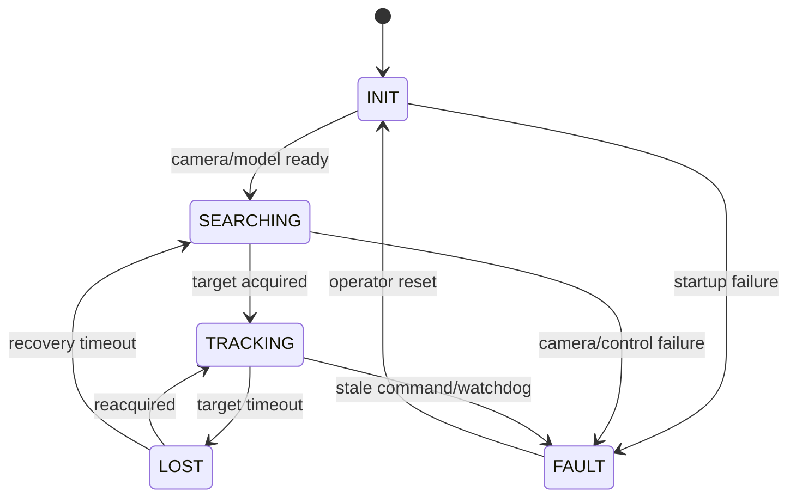

# 00. 프로젝트 헌장과 합격 기준

## 학습 목표

이 단계에서는 “무엇을 만들지”보다 “어떤 조건이면 완성이라고 말할지”를 먼저 정합니다. 실무 프로젝트는 기능 목록이 아니라 측정 가능한 요구사항과 실패 시 동작으로 관리됩니다.

## 1단계: 문제를 한 문장으로 정의하기

좋은 예:

> USB 카메라 또는 Raspberry Pi Camera의 영상에서 `person` 한 명을 선택하고, 탐지 중심이 화면 중앙에 오도록 2축 팬·틸트를 제어하며, Raspberry Pi 5에서 지연과 안전 상태를 관측할 수 있는 시스템을 만든다.

나쁜 예:

> AI로 사람을 잘 추적한다.

객체는 처음에 `person` 하나로 고정하는 것을 권장합니다. 커스텀 물체는 전체 파이프라인이 동작한 뒤 추가합니다. 얼굴 인식처럼 신원 정보를 다루는 기능은 이 프로젝트의 범위에서 제외하고, 사람 또는 일반 물체 **탐지**에 집중합니다.

## 2단계: 범위와 비범위

### MVP 범위

- 녹화 영상과 카메라 입력
- 사전학습 객체 탐지 모델
- Python 기준 결과
- ONNX FP32 내보내기
- ONNX Runtime C++ 추론
- 대상 선택과 일시적 추적
- 모의 서보 드라이버
- Raspberry Pi 실제 팬·틸트
- ROS 2 토픽과 launch
- 재현 가능한 벤치마크와 데모

### 초기 비범위

- 얼굴 식별과 개인 데이터베이스
- 여러 카메라의 3차원 위치 추정
- 자율주행용 Navigation2
- 로봇 팔 계획용 MoveIt 2
- 강화학습 기반 제어
- 클라우드 스트리밍 서비스
- TensorRT 전용 최적화

팬·틸트 카메라에는 Nav2나 MoveIt 2가 필요하지 않습니다. ROS 2의 통신, lifecycle, 관측성부터 정확히 구현한 뒤 이동 로봇이나 매니퓰레이터 확장 때 도입합니다.

## 3단계: 기능 요구사항

| ID | 요구사항 | 검증 방법 |
| --- | --- | --- |
| FR-01 | 파일, USB 카메라, 모의 입력을 선택할 수 있다 | 각 입력으로 5분 실행 |
| FR-02 | 설정한 클래스만 후보로 남긴다 | 다중 클래스 샘플 테스트 |
| FR-03 | 선택 정책에 따라 대상 하나를 고른다 | 중심·신뢰도·크기 정책 테스트 |
| FR-04 | 대상 오차를 정규화 좌표로 계산한다 | 합성 좌표 단위 테스트 |
| FR-05 | 모의 또는 실제 드라이버로 팬·틸트 명령을 보낸다 | 드라이버 계약 테스트 |
| FR-06 | 대상 유실, 카메라 단절, 오래된 명령을 감지한다 | fault injection |
| FR-07 | FPS, 단계별 지연, 드롭, 온도를 기록한다 | 로그 스키마 검사 |

## 4단계: 비기능 요구사항

- **재현성:** 모델 checksum, 의존성 lock, 빌드 명령, 샘플 입력을 저장합니다.
- **실시간성:** 입력부터 명령까지의 `capture_ts` 기반 지연을 측정합니다.
- **신선도:** 소비하지 못한 프레임은 버리고 `frame_age_ms`를 기록합니다.
- **안전:** 각도, 속도, 가속도, 명령 age를 제한합니다.
- **이식성:** 핵심 로직은 ROS 2와 GPIO에 직접 의존하지 않습니다.
- **관측성:** 정상 실행뿐 아니라 drop, timeout, 재연결을 구조화 로그로 남깁니다.

## 5단계: 상태기계



각 상태에서 모터가 무엇을 하는지 명시합니다.

- `INIT`: 출력 비활성, 설정과 장치를 검증합니다.
- `SEARCHING`: 기본은 정지입니다. 스캔 기능은 별도 확장으로 둡니다.
- `TRACKING`: PID 출력에 제한기를 적용합니다.
- `LOST`: 마지막 명령을 영원히 유지하지 않습니다. 정지 또는 천천히 중립으로 복귀합니다.
- `FAULT`: PWM을 안전 상태로 만들고 명시적 복구 전까지 움직이지 않습니다.

## 6단계: 저장소 목표 구조

```text
smart-tracker/
├─ apps/
│  ├─ python_reference/
│  └─ tracker_cli/
├─ cpp/
│  ├─ include/tracker/
│  ├─ src/
│  └─ tests/
├─ ros2_ws/src/
│  ├─ tracker_interfaces/
│  ├─ tracker_perception/
│  └─ tracker_control/
├─ configs/
├─ models/
├─ samples/
├─ scripts/
├─ docs/
├─ benchmarks/
├─ CMakeLists.txt
└─ README.md
```

대용량 모델과 원본 데이터는 Git에 직접 올리지 말고 다운로드 스크립트, checksum, 라이선스와 데이터 출처를 남깁니다. 작은 골든 입력과 기대 결과만 버전 관리합니다.

## 실습

1. [`templates/PROJECT_SPEC.md`](./templates/PROJECT_SPEC.md)를 복사합니다.
2. 대상 클래스, 입력, 개발 PC, 목표 보드를 작성합니다.
3. FR-01~07을 프로젝트 이슈로 만듭니다.
4. 각 요구사항에 검증 명령과 산출물 경로를 연결합니다.
5. 비범위를 README에 공개합니다.

## 완료 조건

- 한 문장 문제 정의가 있다.
- MVP와 비범위가 분리되어 있다.
- 7개 이상의 요구사항이 시험과 연결되어 있다.
- 정상·유실·고장 상태의 모터 동작이 정의되어 있다.
- 하드웨어가 없어도 수행할 소프트웨어 MVP가 정의되어 있다.

## 면접에서 설명할 내용

> “객체 탐지 정확도만 목표로 두지 않고 종단 지연, 프레임 신선도, 유실 시 안전 동작을 요구사항으로 만들었습니다. 그래서 카메라가 추론보다 빠를 때는 bounded latest-frame queue로 오래된 프레임을 폐기하고, 제어 명령에는 timeout을 적용했습니다.”

