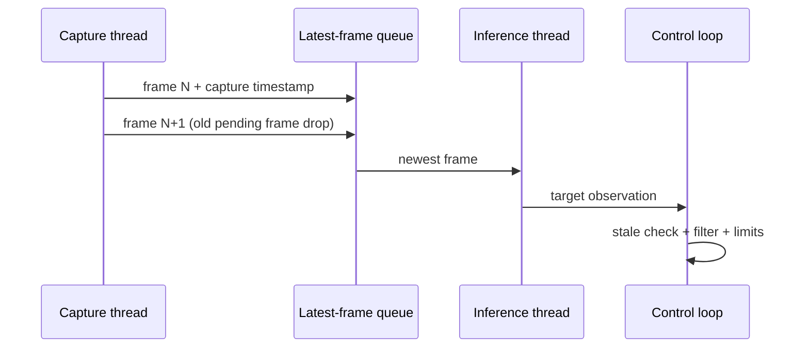

# 05. C++ 실시간 추론 엔진

## 목표

ONNX 계약을 구현하는 테스트 가능한 C++20 라이브러리를 만들고, 카메라 입력 속도보다 추론이 느려져도 오래된 프레임이 쌓이지 않는 실시간 파이프라인을 구성합니다.

## 1단계: 책임 분리

```text
FrameSource
  → Preprocessor
  → InferenceBackend
  → Decoder
  → TargetSelector
  → Tracker
  → Controller
  → ServoDriver
```

핵심 데이터 형식은 ROS 2나 OpenCV UI에 종속시키지 않습니다.

```cpp
struct Detection {
  int class_id;
  float confidence;
  cv::Rect2f box_xywh;
};

struct InferenceResult {
  std::uint64_t frame_id;
  std::chrono::steady_clock::time_point captured_at;
  std::vector<Detection> detections;
};
```

## 2단계: ONNX Runtime session

구현 체크리스트:

- `Ort::Env`와 `Ort::Session`의 수명이 tensor보다 길다.
- 입력·출력 이름을 모델에서 읽고 계약과 비교한다.
- shape와 dtype이 다르면 친절한 오류로 종료한다.
- CPU thread 설정은 벤치마크로 결정한다.
- warm-up을 측정 구간에서 제외한다.
- 입력 buffer를 가능하면 재사용한다.
- 실패 로그에 모델 checksum과 provider를 포함한다.

개념적 흐름:

```cpp
Ort::Env env{ORT_LOGGING_LEVEL_WARNING, "smart-tracker"};
Ort::SessionOptions options;
options.SetGraphOptimizationLevel(
    GraphOptimizationLevel::ORT_ENABLE_ALL);

Ort::Session session{env, model_path.c_str(), options};
// metadata 검증 → 입력 tensor 생성 → session.Run → Decoder
```

릴리스마다 C++ API와 패키징 방식이 달라질 수 있으므로 [ONNX Runtime C++ 공식 문서](https://onnxruntime.ai/docs/get-started/with-cpp.html)의 현재 설치 방식을 따르고 버전을 고정합니다.

## 3단계: 전처리 구현

권장 함수 계약:

```cpp
struct TensorInput {
  std::vector<float> values;
  std::array<std::int64_t, 4> shape;
  PreprocessMeta meta;
};

TensorInput preprocess(const cv::Mat& bgr,
                       const ModelContract& contract);
```

검사할 항목:

- 비어 있는 frame 거부
- 연속 메모리 여부
- BGR→RGB 변환
- letterbox scale과 padding
- HWC→CHW 순서
- float32 정규화
- 입력 buffer 크기와 shape 곱의 일치

Python에서 저장한 `.npy` tensor와 동일 픽셀을 비교합니다. 시각 결과만 보고 통과시키지 않습니다.

## 4단계: 후처리 구현

Decoder는 모델별 adapter로 분리합니다.

```cpp
class OutputDecoder {
 public:
  virtual ~OutputDecoder() = default;
  virtual std::vector<Detection> decode(
      std::span<const Ort::Value> outputs,
      const PreprocessMeta& meta) const = 0;
};
```

예:

- `YoloRawDecoder`
- `YoloEndToEndDecoder`

후처리 순서:

1. output rank·shape 검증
2. confidence 계산
3. class filtering
4. 좌표 변환
5. NMS가 외부 책임이면 class-aware NMS
6. letterbox 제거와 원본 좌표 복원
7. 이미지 경계 clamp
8. 비정상 숫자 제거

## 5단계: 실시간 producer/consumer



정책:

- queue capacity 1 또는 2
- 새 frame이 오면 아직 처리하지 않은 오래된 frame을 폐기
- `captured_at`은 `steady_clock`으로 캡처 직후 기록
- inference 결과에도 원래 timestamp를 전달
- 제어기는 결과 age가 timeout을 넘으면 사용하지 않음
- 종료 신호는 모든 thread가 관찰하고 join

측정 FPS는 `processed_frames / wall_time`만 쓰지 않습니다. `camera_frames`, `processed_frames`, `dropped_frames`, `frame_age_ms`를 함께 기록합니다.

## 6단계: 타이밍

프레임별로 다음 timestamp를 기록합니다.

```text
captured
dequeued
preprocess_start/end
inference_start/end
postprocess_end
control_commanded
displayed
```

파생 지표:

- queue wait
- preprocess/inference/postprocess 시간
- capture→detection age
- capture→motor command 종단 지연
- p50/p95/p99
- 1분 구간별 drop ratio

## 7단계: CMake와 품질

```cmake
add_library(tracker_core
  src/preprocessor.cpp
  src/yolo_raw_decoder.cpp
  src/onnx_runtime_backend.cpp
)

target_compile_features(tracker_core PUBLIC cxx_std_20)
target_link_libraries(tracker_core
  PUBLIC opencv_core
  PRIVATE onnxruntime
)

add_executable(tracker_cli apps/tracker_cli.cpp)
target_link_libraries(tracker_cli PRIVATE tracker_core)
```

개발 빌드:

- `-Wall -Wextra -Wpedantic`
- clang-format
- clang-tidy
- ASan/UBSan
- 테스트에서 작은 mock output 사용

벤치마크는 sanitizer가 없는 Release 빌드로 수행합니다.

## 실습 순서

1. 모델 metadata 출력 CLI
2. 단일 tensor inference
3. 단일 이미지 전처리·후처리
4. Python/C++ 골든 parity
5. MP4 순차 처리
6. bounded latest-frame queue
7. USB 카메라
8. graceful shutdown과 camera reconnect

## 완료 조건

- C++ 결과가 골든 parity 목표를 만족한다.
- output shape가 틀리면 crash 대신 명시적 오류가 난다.
- 30분 실행 동안 메모리가 계속 증가하지 않는다.
- 처리 지연이 생겨도 queue 길이가 제한된다.
- p50/p95/p99와 drop ratio가 보고된다.

## 면접 포인트

> “카메라 FPS보다 추론이 느릴 때 FIFO를 유지하면 제어 입력이 낡아집니다. 그래서 capacity 1의 latest-frame queue를 사용하고 capture timestamp로 frame age를 측정했습니다. 처리량뿐 아니라 p95 종단 지연과 drop ratio를 함께 최적화했습니다.”

