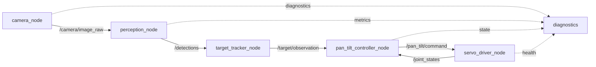

# 08. ROS 2 Jazzy 노드 통합

## 목표

동작하는 단일 프로세스를 ROS 2 노드로 무작정 잘게 쪼개지 않고, 교체·기록·장애 격리가 필요한 경계에만 인터페이스를 둡니다.

## 기준 조합

- Ubuntu 24.04
- ROS 2 Jazzy Jalisco
- Gazebo Harmonic
- `ros_gz_bridge`

Jazzy는 2029년 5월까지 지원되는 장기 지원 배포판이고, Gazebo 문서는 Jazzy와 Harmonic을 권장 조합으로 안내합니다. 튜토리얼을 찾을 때 Gazebo Classic과 최신 Gazebo를 혼동하지 마세요.

## 1단계: 통신 의미 선택

ROS 2의 일반 원칙:

- **topic:** 카메라, 탐지, 목표 오차처럼 계속 흐르는 데이터
- **service:** 설정 읽기, 즉시 캘리브레이션처럼 짧은 요청·응답
- **action:** 긴 캘리브레이션, 스캔 동작처럼 feedback·cancel이 필요한 작업

팬·틸트의 연속 목표 명령을 service로 보내지 않습니다.

## 2단계: 권장 노드 그래프



초기에는 perception과 tracker를 한 노드로 합쳐도 됩니다. 프로파일링 결과 프로세스 간 이미지 복사가 병목이면 composition 또는 intra-process communication을 검토합니다.

## 3단계: 인터페이스 표

| 이름 | 형식 예시 | QoS 출발점 | 의미 |
| --- | --- | --- | --- |
| `/camera/image_raw` | `sensor_msgs/msg/Image` | sensor data, best effort, depth 작게 | 최신 영상 |
| `/detections` | `vision_msgs/msg/Detection2DArray` | best effort 또는 reliable | 프레임별 탐지 |
| `/target/observation` | custom message | reliable, depth 1 | 정규화 오차와 timestamp |
| `/pan_tilt/command` | custom 또는 trajectory message | reliable, depth 1 | 제한 전 목표가 아닌 안전 명령 |
| `/joint_states` | `sensor_msgs/msg/JointState` | sensor data | 가능한 경우 실제/추정 각도 |
| `/diagnostics` | `diagnostic_msgs` | reliable | 상태와 오류 |

QoS는 “reliable이 항상 좋다”가 아닙니다. 실시간 센서에서 오래된 메시지를 완벽히 전달하는 것보다 최신성이 중요할 수 있습니다. publisher와 subscriber의 호환성도 테스트합니다.

## 4단계: timestamp와 frame

- 원본 `header.stamp`를 탐지와 관측까지 유지합니다.
- 처리 완료 시각으로 덮어쓰지 않습니다.
- 이미지 좌표는 optical frame 기준임을 명시합니다.
- 카메라 기구의 `base_link`, `pan_link`, `tilt_link`, `camera_link`, optical frame을 TF tree로 정의합니다.
- 제어기는 `now - observation_stamp`를 검사합니다.

## 5단계: parameter

런타임 parameter 예:

- confidence/IoU threshold
- target class
- deadband
- PID gain
- 관측 timeout
- 각도와 속도 제한

변경하면 안 되는 model input shape, tensor layout 같은 계약은 일반 parameter로 조용히 바꾸지 않습니다. 모델 artifact와 함께 버전 관리합니다.

parameter callback에서 범위를 검증하고, 잘못된 값은 거부합니다.

## 6단계: lifecycle과 watchdog

하드웨어 노드의 권장 단계:

- unconfigured: 드라이버 없음
- inactive: 장치 열림, PWM 비활성
- active: 명령 수신과 출력 허용
- error: 출력 비활성, 진단 발행

제어 명령에 timestamp가 없더라도 수신 시각으로 timeout을 적용합니다. controller 노드가 죽었을 때 servo driver 자체 watchdog가 출력을 안전하게 만들어야 합니다.

## 7단계: rosbag2 회귀 시험

1. 카메라 영상과 필요한 TF를 bag으로 기록합니다.
2. perception 결과의 골든 요약을 만듭니다.
3. CI 또는 개발 PC에서 bag을 재생합니다.
4. 탐지 수, target state, latency 범위를 검사합니다.
5. 모델 또는 코드 변경 전후를 같은 bag으로 비교합니다.

원본 이미지 bag은 크므로 짧은 공개 가능 bag을 smoke test에 사용하고, 긴 내부 bag은 별도 artifact 저장소에 둡니다.

## 8단계: launch

환경별 launch/config를 분리합니다.

```text
config/
  common.yaml
  desktop.yaml
  raspberry_pi.yaml
launch/
  replay.launch.py
  desktop_camera.launch.py
  hardware.launch.py
  simulation.launch.py
```

`replay.launch.py`는 모터가 기본 비활성 상태여야 합니다.

## Nav2와 MoveIt 2는 언제 쓰는가

- 이동 로봇이 목표 위치로 주행해야 할 때: Navigation2
- 로봇 팔이 충돌을 피하며 자세를 계획할 때: MoveIt 2
- 2축 카메라 중심 맞추기: 현재 controller와 joint interface로 충분

프레임워크 이름을 많이 넣는 것보다 문제에 필요한 최소 구성과 선택 근거를 설명하는 편이 포트폴리오에 강합니다.

## 완료 조건

- 각 topic/service/action의 선택 근거가 있다.
- 이미지 timestamp가 제어까지 보존된다.
- QoS 호환과 늦은 메시지를 시험한다.
- bag 재생만으로 perception·control 회귀가 가능하다.
- controller가 죽어도 driver watchdog가 안전 상태로 간다.

## 면접 포인트

> “영상은 최신성이 중요해 작은 depth의 sensor QoS를 사용했고, 모터 명령은 reliable과 별도 watchdog를 썼습니다. 카메라 timestamp를 결과까지 보존해 ROS callback 시간이 아니라 실제 관측 age를 기준으로 stale command를 차단했습니다.”

