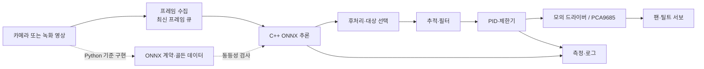

# Smart AI Tracking System

Python으로 준비한 객체 탐지 모델을 ONNX로 내보내고, C++ 추론 엔진과 ROS 2 노드로 배포한 뒤, Raspberry Pi의 팬·틸트 카메라가 대상을 따라가게 만드는 실무형 포트폴리오 프로젝트입니다.

이 문서 집의 목표는 “YOLO를 실행해 봤다”가 아닙니다. 모델 정확도, 런타임 호환성, 실시간 지연, 제어 안정성, 하드웨어 안전, 장애 복구를 각각 측정하고 설명할 수 있는 엔지니어를 만드는 것입니다.

> 기본 경로는 **PC에서 녹화 영상으로 시작 → Python 기준 구현 → ONNX 계약 검증 → C++ 실시간 추론 → 모의 서보 제어 → Raspberry Pi 배포 → ROS 2 통합**입니다. 하드웨어를 처음부터 구매하지 않아도 7단계까지 진행할 수 있습니다.

## 완성 결과

최종 저장소는 다음 질문에 코드와 숫자로 답해야 합니다.

- Python 모델과 C++ 모델의 출력이 같은가?
- 평균 FPS가 아니라 p95 종단 지연과 프레임 신선도는 얼마인가?
- 추론이 느려질 때 오래된 프레임이 쌓이지 않는가?
- 탐지가 잠시 사라지거나 카메라가 끊기면 안전하게 정지하는가?
- 서보가 목표를 따라갈 때 정착 시간, 오버슈트, 정상 상태 오차는 얼마인가?
- 개발 PC, 시뮬레이터, Raspberry Pi에서 같은 인터페이스를 유지하는가?
- 다른 개발자가 문서만 보고 빌드, 실행, 재현할 수 있는가?

권장 최종 데모는 90초입니다.

1. 사람이 화면 가장자리로 이동한다.
2. 탐지 상자와 지연 시간이 표시된다.
3. 팬·틸트 카메라가 부드럽게 중심을 맞춘다.
4. 대상이 사라지면 서보가 난폭하게 움직이지 않고 대기 상태가 된다.
5. 대시보드 또는 로그에서 FPS, p95 지연, 드롭 프레임, CPU 온도를 확인한다.

## 시스템 구조



실시간 경로에서는 크기가 1~2인 **최신 프레임 큐**를 사용합니다. 처리 속도보다 카메라 입력이 빠를 때 오래된 영상을 순서대로 처리하면 FPS는 높아 보여도 로봇은 과거를 보고 움직입니다. 큐가 찼다면 오래된 프레임을 버리는 것이 이 프로젝트의 기본 정책입니다.

## 권장 기술 기준선

| 영역 | 기본 선택 | 선택 이유 |
| --- | --- | --- |
| 연구·평가 | Python, PyTorch, Ultralytics | 빠른 기준 모델과 데이터 반복 |
| 교환 형식 | ONNX | 학습 코드와 C++ 런타임 사이의 명시적 계약 |
| 네이티브 추론 | ONNX Runtime C++ | CPU 우선, 플랫폼 간 동일 API |
| 영상 처리 | OpenCV C++ | 캡처, 전처리, 시각화 |
| 로봇 미들웨어 | ROS 2 Jazzy | Ubuntu 24.04 기반 장기 지원 배포판 |
| 시뮬레이션 | Gazebo Harmonic | ROS 2 Jazzy 권장 조합 |
| 엣지 장치 | Raspberry Pi 5 권장, 4 가능 | ARM64 배포와 실제 입출력 경험 |
| 서보 구동 | PCA9685 + 외부 5V 전원 | PWM 안정성과 GPIO 보호 |

2026년 기준 새 프로젝트의 학습 예시는 최신 Ultralytics 모델을 사용할 수 있지만, 실제 포트폴리오에서는 모델 파일, 패키지 버전, 출력 텐서 계약을 반드시 고정합니다. YOLOv8, YOLO11, YOLO26처럼 세대가 달라지면 출력 형식과 내장 후처리 여부도 달라질 수 있습니다. “YOLO 출력은 항상 같은 shape”이라고 가정하지 마세요.

## 문서 목차

### 0. 설계와 준비

- [프로젝트 헌장과 합격 기준](./00-project-charter.md)
- [개발 환경, 부품, 전기 안전](./01-environment-and-safety.md)
- [12주 실무 커리큘럼](./02-curriculum.md)

### 1. 모델에서 런타임까지

- [Python 비전 기준선 만들기](./03-python-vision-baseline.md)
- [ONNX 계약과 출력 동등성](./04-onnx-contract.md)
- [C++ 실시간 추론 엔진](./05-cpp-inference-engine.md)

### 2. 로봇 제어와 배포

- [추적, PID, 안전 상태기계](./06-tracking-and-control.md)
- [Raspberry Pi 배포와 운영](./07-raspberry-pi-deployment.md)
- [ROS 2 노드 통합](./08-ros2-integration.md)
- [Gazebo 시뮬레이션과 HIL](./09-simulation-and-hil.md)

### 3. 품질과 포트폴리오

- [시험, 벤치마크, 관측성](./10-testing-and-benchmarking.md)
- [포트폴리오 패키징과 면접 준비](./11-portfolio-delivery.md)
- [장애 진단 플레이북](./12-troubleshooting.md)
- [공식 자료와 다음 학습 경로](./13-references.md)
- [산출물 템플릿](./templates/README.md)

## 12주 로드맵 요약

| 주차 | 구현 목표 | 반드시 남길 증거 |
| --- | --- | --- |
| 1 | 요구사항, 저장소, 재현 환경 | 프로젝트 헌장, 아키텍처, ADR |
| 2 | 녹화 영상 Python 기준선 | 고정 입력 영상, 기준 결과 JSON |
| 3 | 데이터·학습·평가 | 데이터 카드, 모델 카드, 오류 분석 |
| 4 | ONNX 내보내기와 동등성 | 입출력 계약, 골든 테스트 |
| 5 | C++ 단일 이미지 추론 | CMake 빌드, Python/C++ 비교 |
| 6 | 실시간 영상 파이프라인 | 최신 프레임 큐, 단계별 타이밍 |
| 7 | 추적과 모의 팬·틸트 | PID 그래프, 상태기계 테스트 |
| 8 | Raspberry Pi 네이티브 배포 | 설치 스크립트, 운영 로그 |
| 9 | 실제 서보와 안전장치 | 배선도, 한계각, 비상 정지 |
| 10 | ROS 2 노드 분리 | 인터페이스, launch, rosbag |
| 11 | 부하·고장·회귀 시험 | 벤치마크 보고서, 테스트 매트릭스 |
| 12 | 데모와 채용 패키지 | 90초 영상, README, 이력서 문장 |

주당 8~12시간을 기준으로 합니다. 시간이 부족하면 1~7주차를 먼저 완성해 **소프트웨어 전용 MVP**를 만들고, 하드웨어와 ROS 2를 별도 마일스톤으로 추가합니다.

## 포트폴리오 합격선

다음은 절대적인 제품 사양이 아니라, 첫 측정 전에 세우는 프로젝트 목표입니다. 하드웨어와 모델에 따라 조정하되 목표를 사후에 유리하게 바꾸지 말고 변경 이유를 ADR에 남깁니다.

| 항목 | 최소 목표 예시 |
| --- | --- |
| 재현성 | 새 환경에서 문서대로 30분 안에 빌드·샘플 실행 |
| ONNX FP32 동등성 | 클래스 일치율 99% 이상, 매칭 박스 IoU 0.99 이상 |
| 프레임 정책 | 대기열이 무한히 증가하지 않으며 프레임 age를 기록 |
| Raspberry Pi CPU | 320~416 입력에서 신선한 추론 7 FPS 이상을 목표로 측정 |
| 지연 | 종단 p50·p95·p99를 분리 보고, p95 목표는 장치별로 선언 |
| 제어 | 정착 시간 1.5초 이내, 오버슈트 15% 이하, 정상 오차 화면 폭의 5% 이하를 목표 |
| 안전 | 탐지·카메라·제어 명령 timeout 시 정지 또는 중립 상태 |
| 품질 | 단위·계약·통합·하드웨어 시험이 각각 존재 |

“30 FPS 달성”을 미리 약속하지 않습니다. 입력 해상도, 모델, 전원, 냉각, 런타임, 후처리에 따라 결과가 달라지므로 측정값과 조건을 함께 공개하는 것이 더 전문적입니다.

## 학습 원칙

1. **기준선을 먼저 만든다.** 커스텀 학습 전에 사전학습 모델과 녹화 영상으로 전체 경로를 연결합니다.
2. **경계마다 계약을 둔다.** 색상 순서, resize, 정규화, 좌표계, 텐서 shape, NMS 책임을 문서화합니다.
3. **하드웨어를 추상화한다.** `MockServoDriver`와 실제 `Pca9685ServoDriver`가 같은 인터페이스를 구현하게 합니다.
4. **평균값만 보지 않는다.** p95 지연, 드롭, 온도, 복구 시간까지 측정합니다.
5. **실패를 포트폴리오로 만든다.** 흔들림, 조도 변화, 카메라 단절 같은 실패 사례와 수정 근거를 기록합니다.

## 빠른 시작

하드웨어가 없다면 다음 순서로 시작합니다.

```text
00 프로젝트 헌장 작성
→ 고정 MP4와 사전학습 소형 모델 준비
→ Python 기준 결과 JSON 생성
→ ONNX 출력 계약 작성 및 동등성 검사
→ C++ 단일 이미지 추론
→ 최신 프레임 실시간 파이프라인
→ 모의 서보와 PID 그래프
```

각 단계에서 `templates/`의 문서를 복사해 프로젝트의 `docs/`에 채우면 마지막 주에 포트폴리오를 급히 꾸밀 필요가 없습니다.

